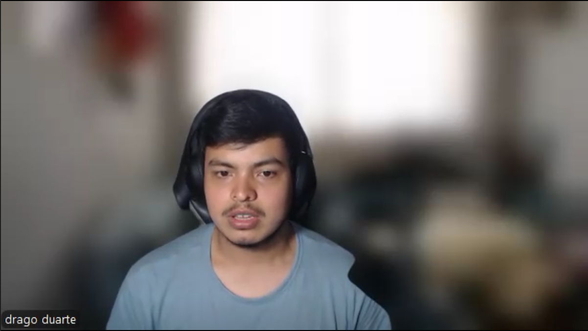
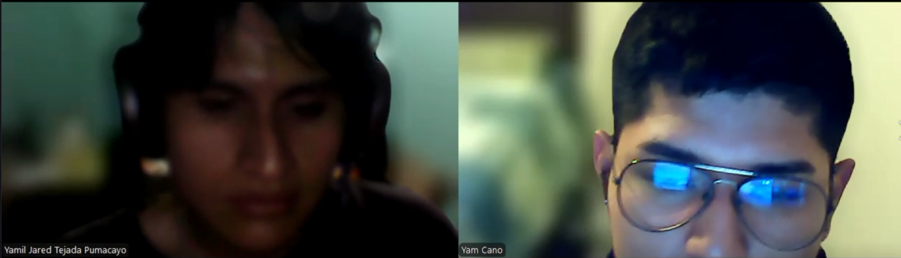

  
## Universidad Peruana de Ciencias Aplicadas

**Facultad:** Ingeniería

**Carrera:** Ingeniería de Software

**Periodo:** 2026-20

**Código del Curso**: 1ASI0730

**Curso:** Aplicaciones Web

**NRC:** 8093

**Profesor:** Efraín Ricardo Bautista Ubillús

### Informe de Trabajo Final

**Startup:** GreenTech

**Nombre del producto:** SkyCrop

#### Relación de integrantes

| Integrante                              | Código         |
|-----------------------------------------|----------------|
|                                         |   U            |
| Cano Gomez,Yam Antony                   |   U202423775   |
| Sunio Danilo Landa Sánchez              |   U202423973   |
|                                         |   U            |
|                                         |   U            |

<h3>Setiembre 2026</h3>
 

---
# Registro de Versiones del Informe 

|Versión|Fecha|Autor|Fecha de modificación|
|:------|:----|:----|:--------------------|
|||||

# Project Report Collaboration Insights 

# Contenido 

## Tabla de contenidos 
- [Registro de Versiones del Informe](#registro-de-versiones-del-informe)
- [Project Report Collaboration Insights](#project-report-collaboration-insights)
- [Contenido](#contenido)
  - [Tabla de contenidos](#tabla-de-contenidos)
- [Student Outcome](#student-outcome)
- [Capítulo I: Introducción](#capítulo-i-introducción)
  - [1.1. Startup Profile](#11-startup-profile)
    - [1.1.1. Descripción de la Startup](#111-descripción-de-la-startup)
    - [1.1.2. Perfiles de integrantes del equipo](#112-perfiles-de-integrantes-del-equipo)
  - [1.2. Solution Profile](#12-solution-profile)
    - [1.2.1 Antecedentes y problemática](#121-antecedentes-y-problemática)
    - [1.2.2 Lean UX Process.](#122-lean-ux-process)
      - [1.2.2.1. Lean UX Problem Statements.](#1221-lean-ux-problem-statements)
      - [1.2.2.2. Lean UX Assumptions.](#1222-lean-ux-assumptions)
      - [1.2.2.3. Lean UX Hypothesis Statements.](#1223-lean-ux-hypothesis-statements)
      - [1.2.2.4. Lean UX Canvas.](#1224-lean-ux-canvas)
  - [1.3. Segmentos objetivo.](#13-segmentos-objetivo)
- [Capítulo II: Requirements Elicitation \& Analysis](#capítulo-ii-requirements-elicitation--analysis)
  - [2.1. Competidores.](#21-competidores)
    - [2.1.1. Análisis competitivo.](#211-análisis-competitivo)
    - [2.1.2. Estrategias y tácticas frente a competidores.](#212-estrategias-y-tácticas-frente-a-competidores)
  - [2.2. Entrevistas.](#22-entrevistas)
    - [2.2.1. Diseño de entrevistas.](#221-diseño-de-entrevistas)
    - [2.2.2. Registro de entrevistas.](#222-registro-de-entrevistas)
    - [2.2.3. Análisis de entrevistas.](#223-análisis-de-entrevistas)
  - [2.3. Needfinding.](#23-needfinding)
    - [2.3.1. User Personas.](#231-user-personas)
    - [2.3.2. User Task Matrix.](#232-user-task-matrix)
    - [2.3.3. User Journey Mapping.](#233-user-journey-mapping)
    - [2.3.4. Empathy Mapping.](#234-empathy-mapping)
  - [2.4. Big Picture EventStorming.](#24-big-picture-eventstorming)
  - [2.5. Ubiquitous Language.](#25-ubiquitous-language)
- [Capítulo III: Requirements Specification](#capítulo-iii-requirements-specification)
  - [3.1. User Stories.](#31-user-stories)
  - [3.2. Impact Mapping.](#32-impact-mapping)
  - [3.3. Product Backlog.](#33-product-backlog)
- [Capítulo IV: Product Design](#capítulo-iv-product-design)
  - [4.1. Style Guidelines.](#41-style-guidelines)
    - [4.1.1. General Style Guidelines.](#411-general-style-guidelines)
    - [4.1.2. Web Style Guidelines.](#412-web-style-guidelines)
  - [4.2. Information Architecture.](#42-information-architecture)
    - [4.2.1. Organization Systems.](#421-organization-systems)
    - [4.2.2. Labeling Systems.](#422-labeling-systems)
    - [4.2.3. SEO Tags and Meta Tags](#423-seo-tags-and-meta-tags)
    - [4.2.4. Searching Systems.](#424-searching-systems)
    - [4.2.5. Navigation Systems.](#425-navigation-systems)
  - [4.3. Landing Page UI Design.](#43-landing-page-ui-design)
    - [4.3.1. Landing Page Wireframe.](#431-landing-page-wireframe)
    - [4.3.2. Landing Page Mock-up.](#432-landing-page-mock-up)
  - [4.4. Web Applications UX/UI Design.](#44-web-applications-uxui-design)
    - [4.4.1. Web Applications Wireframes.](#441-web-applications-wireframes)
    - [4.4.2. Web Applications Wireflow Diagrams.](#442-web-applications-wireflow-diagrams)
    - [4.4.2. Web Applications Mock-ups.](#442-web-applications-mock-ups)
    - [4.4.3. Web Applications User Flow Diagrams.](#443-web-applications-user-flow-diagrams)
  - [4.5. Web Applications Prototyping.](#45-web-applications-prototyping)
  - [4.6. Domain-Driven Software Architecture.](#46-domain-driven-software-architecture)
    - [4.6.1. Design-Level EventStorming.](#461-design-level-eventstorming)
    - [4.6.2. Software Architecture Context Diagram.](#462-software-architecture-context-diagram)
    - [4.6.3. Software Architecture Container Diagrams.](#463-software-architecture-container-diagrams)
    - [4.6.4. Software Architecture Components Diagrams.](#464-software-architecture-components-diagrams)
  - [4.7. Software Object-Oriented Design.](#47-software-object-oriented-design)
    - [4.7.1. Class Diagrams.](#471-class-diagrams)
  - [4.8. Database Design.](#48-database-design)
    - [4.8.1. Database Diagrams.](#481-database-diagrams)
- [Capítulo V: Product Implementation, Validation \& Deployment](#capítulo-v-product-implementation-validation--deployment)
  - [5.1. Software Configuration Management.](#51-software-configuration-management)
    - [5.1.1. Software Development Environment Configuration.](#511-software-development-environment-configuration)
    - [5.1.2. Source Code Management.](#512-source-code-management)
    - [5.1.3. Source Code Style Guide \& Conventions.](#513-source-code-style-guide--conventions)
    - [5.1.4. Software Deployment Configuration.](#514-software-deployment-configuration)
  - [5.2. Landing Page, Services \& Applications Implementation.](#52-landing-page-services--applications-implementation)
    - [5.2.X. Sprint n](#52x-sprint-n)
      - [5.2.X.1. Sprint Planning n.](#52x1-sprint-planning-n)
      - [5.2.X.2. Aspect Leaders and Collaborators.](#52x2-aspect-leaders-and-collaborators)
      - [5.2.X.3. Sprint Backlog n.](#52x3-sprint-backlog-n)
      - [5.2.X.4. Development Evidence for Sprint Review.](#52x4-development-evidence-for-sprint-review)
      - [5.2.X.5. Execution Evidence for Sprint Review.](#52x5-execution-evidence-for-sprint-review)
      - [5.2.X.6. Services Documentation Evidence for Sprint Review.](#52x6-services-documentation-evidence-for-sprint-review)
      - [5.2.X.7. Software Deployment Evidence for Sprint Review.](#52x7-software-deployment-evidence-for-sprint-review)
      - [5.2.X.8. Team Collaboration Insights during Sprint.](#52x8-team-collaboration-insights-during-sprint)
- [Conclusiones](#conclusiones)
- [Bibliografía](#bibliografía)
- [Anexos](#anexos)

# Student Outcome 

# Capítulo I: Introducción 

## 1.1. Startup Profile 

### 1.1.1. Descripción de la Startup
**GreenTech** es una pequeña empresa de reciente creación dentro del sector *AgTech* , destacada por su alto potencial innovador y tecnológico. Ya que nuestro modelo de negocio es altamente escalable y nuestro crecimiento está proyectado para ser exponencial, abarcando desde pequeños productores independientes hasta grandes asociaciones agrarias. 

Nacemos con el firme propósito de democratizar el acceso a la agricultura de precisión. Actualmente, el sector agrícola enfrenta un desafío crítico que es el monitoreo manual de las parcelas,ya que requiere una inversión insostenible de tiempo y esfuerzo físico, y suele detectar problemas cuando el daño en los cultivos es irreversible. Por otro lado, las tecnologías modernas que podrían solucionar esto se caracterizan por ser ecosistemas cerrados, de costos prohibitivos y sin opciones de modificación, dejando a gran parte de los productores en desventaja tecnológica y competitiva.

Ante este panorama, **GreenTech** se enfoca en el desarrollo de plataformas de software accesibles, automatizadas y personalizables que rompen con los monopolios del software comercial tradicional. Buscamos transformar la gestión del campo reemplazando las inspecciones manuales por recolección y análisis de datos de vanguardia. Nuestro objetivo es empoderar a los agricultores, ingenieros agrónomos y cooperativas, brindándoles las capacidades tecnológicas necesarias para identificar de manera temprana amenazas como el estrés hídrico, las plagas o las deficiencias de fertilizantes. Al impulsar la toma de decisiones basadas en datos precisos y diagnósticos visuales, no solo ayudamos a incrementar la rentabilidad de las cosechas, sino que promovemos prácticas agrícolas mucho más eficientes y sostenibles a largo plazo.

**Misión :**
Proveer a los productores agrícolas de soluciones tecnológicas accesibles y automatizadas para el monitoreo inteligente de sus parcelas, facilitando la detección temprana de anomalías y optimizando el uso de recursos críticos para lograr una agricultura más rentable y sostenible.

**Visión :**
Convertirnos en la empresa *AgTech* líder y referente en Latinoamérica, empoderando a agricultores y cooperativas de todos los tamaños mediante tecnología innovadora que elimine las barreras de entrada a la agricultura de precisión.

### 1.1.2. Perfiles de integrantes del equipo 

| **Integrante** | |
| :--- | :--- |
| **Código del Estudiante** | |
| **Carrera** | |
| **Descripción** | |
| **Foto** | |
--------------

| **Integrante** | Cano Gomez Yam Antony Gabriel |
| :--- | :--- |
| **Código del Estudiante** | U202423775 |
| **Carrera** | Ingeniería de Software |
| **Descripción** | |
| **Foto** | |
----------------------

| **Integrante** | |
| :--- | :--- |
| **Código del Estudiante** | |
| **Carrera** | |
| **Descripción** | |
| **Foto** | |
---------------------

| **Integrante** | |
| :--- | :--- |
| **Código del Estudiante** | |
| **Carrera** | |
| **Descripción** | |
| **Foto** | |
---------------------

| **Integrante** | |
| :--- | :--- |
| **Código del Estudiante** | |
| **Carrera** | |
| **Descripción** | |
| **Foto** | |

## 1.2. Solution Profile 

### 1.2.1 Antecedentes y problemática 

| 5w & 2H | Descripcion|
|---------|------------|
| **What: ¿Cuál es el problema?**| El monitoreo agrícola manual requiere un alto costo de tiempo y esfuerzo físico, debido a la necesidad de supervisar extensas áreas de cultivo de manera constante. A esto se suma la falta de acceso a software comercial de automatización de vuelos de drones y análisis de imágenes agrícolas, debido a su alto costo y naturaleza cerrada, lo que limita la posibilidad de contar con soluciones personalizables y obliga a los agricultores a depender de procesos manuales poco eficientes.|
| **When: ¿Cuándo sucede este problema?**| Durante las revisiones periódicas del terreno, siendo especialmente crítico cuando las plagas, el estrés hídrico o las deficiencias de fertilizante avanzan rápidamente sin ser detectados a tiempo.|
| **Where: ¿Dónde se produce este suceso?** | A lo largo de parcelas y grandes extensiones de terrenos agrícolas, donde la escala del campo hace que las inspecciones humanas sean logísticamente ineficientes.|
| **Who: ¿Quiénes están involucrados?** | Los productores y agricultores que deben gestionar los cultivos, así como el personal encargado de la inspección física en el campo.|
| **Why: ¿Cuál es la causa del problema?** | Las alternativas tecnológicas actuales operan como ecosistemas cerrados y rígidos. Al no integrarse con las dinámicas y necesidades agronómicas específicas de cada cultivo, resultan inoperantes para el entorno real del productor, forzándolo a depender de las inspecciones físicas tradicionales. |
| **How: ¿Qué llevó a la persona a llegar a esta situación?** | Se manifiesta a través del monitoreo manual de las parcelas agrícolas, un proceso que requiere de mucho tiempo y esfuerzo físico, y que a menudo no detecta problemas hasta que están muy avanzados|
| **How Much: ¿Cuánto es el impacto financiero?** | Representa grandes pérdidas de cultivos por la identificación tardía de anomalías, además de los altos costos incurridos en la cantidad de horas  necesarias de un trabajador para recorrer la parcela físicamente.|

### 1.2.2 Lean UX Process. 

#### 1.2.2.1. Lean UX Problem Statements. 
*The current state of the agricultural monitoring domain has focused mainly on slow, labor-intensive manual inspections. What existing products/services fail to address is the lack of flexible, customizable, and automated drone flight routing and image processing adapted for the specific agronomic needs of small to medium producers. Our product/service will address this gap by providing subscriptions to our platform that automates flights and generates visual terrain maps to early identify crop stress. Our initial focus will be independent farmers and agricultural cooperatives. We’ll know we are successful when we see a 25% conversion rate to our paid subscriptions (Basic, Professional, or Cooperative) and a recurring usage of the mapping tool within the first 6 months.*

#### 1.2.2.2. Lean UX Assumptions. 

**Business Assumptions:**
* Creemos que los agricultores y cooperativas agrarias están dispuestos a pagar suscripciones (Básico, Profesional y Cooperativa) por una plataforma que sea verdaderamente flexible y se adapte a las necesidades agronómicas específicas de sus terrenos.
* Creemos que nuestro modelo de negocio será altamente escalable al integrarse con drones comerciales estándar, evitando la necesidad de fabricar hardware propio.

**Business Outcome Assumptions:**
* Creemos que lograremos una tasa de conversión del 25% hacia nuestras suscripciones de pago durante los primeros 6 meses.
* Creemos que alcanzaremos un uso recurrente de la plataforma, convirtiéndonos en una herramienta indispensable a lo largo de todo el ciclo de vida del cultivo.

**User Assumptions:**
* Creemos que nuestros usuarios (productores independientes, ingenieros agrónomos y gestores de cooperativas) cuentan con drones, pero carecen de los conocimientos técnicos en programación o de herramientas de software abiertas para automatizarlos.
* Creemos que los usuarios prefieren revisar datos consolidados desde una pantalla antes que realizar inspecciones físicas extenuantes y propensas a errores humanos.

**User Outcome and Benefit Assumptions:**
* Creemos que los usuarios ahorrarán un tiempo masivo y evitarán el gran esfuerzo físico que antes dedicaban a recorrer las parcelas de forma manual.
* Creemos que los usuarios mitigarán la pérdida económica en sus cosechas al identificar de manera temprana amenazas como el estrés hídrico, plagas o deficiencias de fertilizante.

**Feature Assumptions:**
* Creemos que la funcionalidad **Automated drone flight routing** solucionará la necesidad de trazar y personalizar el recorrido del dron sobre áreas delimitadas sin requerir control manual intensivo.
* Creemos que la funcionalidad **Visual terrain map generation** satisfará la necesidad de procesar imágenes aéreas para resaltar anomalías y la salud general del cultivo.
* Creemos que la funcionalidad **Advanced image analysis** cruzará datos visuales de forma automatizada para diagnosticar problemas agronómicos específicos en los planes superiores.
* Creemos que la funcionalidad **Crop history and reporting** respaldará la toma de decisiones mediante el almacenamiento seguro en la nube para comparar ciclos agrícolas estacionales.
* Creemos que la consola **Multi-plot and multi-user management** ayudará a las cooperativas a organizar de forma colaborativa grandes extensiones de tierra y múltiples equipos de trabajo.
  
#### 1.2.2.3. Lean UX Hypothesis Statements. 

**Hypothesis 1**

*We believe we will achieve* a higher recurring usage of the platform for agricultural monitoring
*If* independent farmers, agricultural engineers, and cooperative managers
*Attain* a reduction in the time and manual effort required to plan drone flights over their plots
*With* the Automated Drone Flight Routing feature, which allows users to delimit areas and automatically generate customized flight routes.

**Hypothesis 2**

*We believe we will achieve* a higher recurring usage of the mapping tool
*If* independent farmers, agricultural engineers, and cooperative managers
*Attain* a faster and more understandable visualization of the condition of their crops and terrain
*With* the Visual Terrain Map Generation feature, which processes aerial images and generates visual maps highlighting potential crop anomalies.

**Hypothesis 3**

*We believe we will achieve* greater perceived value of the Professional and Cooperative subscriptions
*If* agricultural engineers and cooperative managers
*Attain* earlier identification of potential agronomic problems such as crop stress, pests, and fertilizer deficiencies
*With* the Advanced Image Analysis feature, which automatically analyzes aerial images to identify relevant visual anomalies.

**Hypothesis 4**

*We believe we will achieve* higher retention and recurring usage of the platform throughout the crop lifecycle
*If* independent farmers, agricultural engineers, and cooperative managers
*Attain* the ability to compare historical crop conditions and use previous monitoring information to support their decisions
*With* the Crop History and Reporting feature, which securely stores monitoring information in the cloud and enables comparison between agricultural cycles.

**Hypothesis 5**

*We believe we will achieve* a higher conversion rate to the Cooperative subscription
*If* cooperative managers and their agricultural teams
*Attain* more efficient collaborative management of multiple plots and users
*With* the Multi-Plot and Multi-User Management console, which allows cooperatives to organize multiple agricultural areas and work collaboratively with different team members.

#### 1.2.2.4. Lean UX Canvas. 
Figura 1
Lean UX Canvas — SkyCrop

## 1.3. Segmentos objetivo. 

**Segmento Objetivo 1: Agricultores**
**Aspectos demográficos:**
- **Edad:** 25 - 55 años.
- **Nivel socioeconómico:** Media - Baja.
- **Tipo de productor:** Pequeños y medianos productores agrícolas, independientes o asociados a cooperativas.
- **Rubro:** Cultivo de productos agrícolas.
- **Nivel de necesidad:** Alta dependencia del monitoreo constante de sus parcelas para prevenir pérdidas.

**Aspectos geográficos:**
- **Nacionalidad:** Peruana.
- **Zona geográfica:** Rural.

**Aspectos psicográficos:**
- **Motivación:** Evitar pérdidas de cosecha por detección tardía de plagas, estrés hídrico o deficiencias de fertilizante; reducir el esfuerzo físico de la inspección manual.
- **Valores:** La productividad, el ahorro de recursos y la sostenibilidad de sus cultivos.
- **Intereses:** Adopción de tecnología accesible que no requiera grandes inversiones ni conocimientos técnicos avanzados.

---------------

**Segmento Objetivo 2: Ingenieros agrónomos**
**Aspectos demográficos:**
- **Edad:** 23 - 45 años.
- **Nivel socioeconómico:** Media - Alta.
- **Tipo de perfil:** Profesionales independientes o vinculados a cooperativas u asociaciones agrarias.
- **Rubro:** Asesoría técnica y gestión agronómica de cultivos.
- **Nivel de necesidad:** Alta demanda de herramientas de diagnóstico eficientes para atender múltiples parcelas o clientes.

**Aspectos geográficos:**
- **Nacionalidad:** Peruana.
- **Zona geográfica:** Rural / semi-urbana.

**Aspectos psicográficos:**
- **Motivación:** Optimizar su tiempo de supervisión en campo, mejorar la precisión de sus diagnósticos y la calidad de su asesoría técnica.
- **Valores:** El rigor técnico, la eficiencia y la toma de decisiones basada en datos.
- **Intereses:** Herramientas digitales que centralicen información de múltiples parcelas y faciliten diagnósticos visuales confiables.

# Capítulo II: Requirements Elicitation & Analysis 

## 2.1. Competidores. 

Hemos identificado a tres empresas con ofertas similares a la de nuestra startup:

- **Pix4D**: Es una empresa de software de fotogrametría, ofrece varios programas bajo licencia para usarse en varias industrias como en la agricultura. Uno de sus productos es Pix4D fields, un software híbrido de mapeo con drones para el análisis de cultivos y agricultura precisa. 
- **DJI Enterprise**: Es una empresa que ofrece drones y software para drones. Uno de sus programas es DJI Terra, el cual consiste en la reconstrucción de terrenos para la adquisición y procesamiento de datos. Este programa es aplicable a la agricultura, permitiendo programar rutas de vuelo y generar mapas de vegetación para obtener información sobre la salud y crecimiento de los cultivos.
- **Geodrone**: Es una empresa perteneciente al grupo RCP que se basa en la provisión de servicios con drones para inspecciones, limpiezas, captura de datos, agricultura, entre otros. Esta empresa además permite fabricar drones personalizados basándose en necesidades operativas. En su servicio de agricultura, la empresa ofrece análisis de cultivos para la generación de mapas NDVI, de cobertura vegetal o de elevación. Además ofrece riego, control de plagas o cosechas mediante drones.

### 2.1.1. Análisis competitivo. 

<table border="1">
  <tr>
    <th colspan="6">Competitive Analysis Landscape</th>
  </tr>
  <tr>
    <th colspan="2">¿Por qué llevar a cabo este análisis?</th>
    <td colspan="4">
      El objetivo de este analisis es conocer más sobre lo que ofrece nuestra competencia para, en base a ello, identificar en que aspectos podemos diferenciarnos y como podemos mejorar nuestro producto. Con estos avances podremos tener un mejor puesto en el mercado.
    </td>
  </tr>
  
  <tr>
  <tr>
    <th colspan="2" rowspan="2">Empresa</th>
    <th>SkyCrop</th>
    <th>Pix4D</th>
    <th>DJI Enterprise</th>
    <th>Geodrone</th>
  </tr>
  <tr>
    <td>
      
    </td>
    <td>
      
    </td>
    <td>
      
    </td>
    <td>
      
    </td>
  </tr>
  
  <tr>
  <th rowspan = "2">Perfil</th>
    <th>Overview</th>
    <td>Plataforma de gestión y configuración de rutinas de vuelo para drones capaces de generar escaneos en terrenos agrícolas.
    </td>
    <td>Plataforma de venta de licencias de software para la obtención de datos, el análisis de cultivos, creación de mapas y guardado en la nube.
    </td>
    <td>Plataforma de venta de drones y de licencias de software apto para la agricultura, capaz de evaluar la salud de cultivos y generar mapas de vegetación.
    </td>
    <td>Plataforma de servicios de drones para la generación de mapas del terreno, seguimiento de cultivos y elaboración de informes agrícolas.
    </td>
  </tr>
  <tr>
    <th>Ventaja Competitiva</th>
    <td>Enfoque en la agricultura, compatibilidad con la mayoría de drones y almacenamiento de datos históricos y de reportes avanzados.
    </td>
    <td>Alta compatibilidad con la mayoría de drones y análisis avanzado a partir de imagenes para generar prescripciones.
    </td>
    <td>Elaboración y venta de drones especializados en la agricultura junto con un programa de análisis y procesamiento.
    </td>
    <td>Servicios realizados con operadores altamente capacitados, generando varios resultados de alta calidad.
    </td>
  </tr>

  <tr>
  <th rowspan = "2">Perfil de Marketing</th>
    <th>Mercado Objetivo</th>
    <td>Agricultores e Ingenieros agrónomos.
    </td>
    <td>Arquitectos, agricultores, topógrafos, ingenieros, entre otros.
    </td>
    <td>Personal de seguridad pública, agricultores, mineros, arquitectos, entre otros.
    </td>
    <td>Ingenieros civiles, agricultores, inspectores, personal de seguridad, entre otros.
    </td>
  </tr>
  <tr>
    <th>Estrategias de Marketing</th>
    <td>Publicación del producto en redes sociales, demostración de casos de exito y alianzas con agrónomos y empresas.
    </td>
    <td>Demostraciones del software y sus resultados, además del ofrecimiento de pruebas gratuitas.
    </td>
    <td>Presentación de casos de uso, publicación de noticias en redes sociales y ofrecimiento de pruebas gratuitas.
    </td>
    <td>Demostraciones de servicios y sus beneficios, publicación de casos de exito y participación en eventos industriales.
    </td>
  </tr>

  <tr>
  <th rowspan = "3">Perfil de Producto</th>
    <th>Productos & Servicios</th>
    <td>Plataforma que programa rutinas de vuelo, escaneos del terreno y emisión de alertas. Se acompaña de un servicio de guardado en la nube para registrar datos históricos y reportes.
    </td>
    <td>Aplicación de escaneo y mapeo del terreno para el análisis de los cultivos. Permite compartir y guardar datos o informes mediante un servicio en la nube.
    </td>
    <td>Software integrable en drones para la reconstruccion de terrenos en 3D y la generación de mapas de indices de vegetación como NDVI o NDRE.
    </td>
    <td>Servicio de análisis de cultivos, generación de mapas, riego, control de plagas o cosecha mediante drones.
    </td>
  </tr>
  <tr>
    <th>Precios & Costos</th>
    <td>Subscripciones mensuales y anuales a partir de $40.
    </td>
    <td>Prueba gratuita y subscripciones mensuales o anuales a partir de $165.
    </td>
    <td>Prueba gratuita y planes anuales a partir de $300.
    </td>
    <td>Cotizable segun servicio.
    </td>
  </tr>
    <tr>
    <th>Canales de Distribución</th>
    <td>Mediante aplicación web y aplicación movil
    </td>
    <td>Mediante sitio web
    </td>
    <td>Mediante sitio web y aplicación movil
    </td>
    <td>Mediante sitio web
    </td>
  </tr>

  <tr>
  <th rowspan = "4">Análisis SWOT</th>
    <th>Fortalezas</th>
    <td>Plataforma web accesible desde cualquier dispositivo, guardado de datos históricos en la nube y alta compatibilidad con drones.
    </td>
    <td>Software especializado para diferentes industrias como en la agricultura. Además, tiene un alto rango de sistemas compatibles.
    </td>
    <td>Amplio ecosistema de drones y softwares, además de programas de alta tecnología.
    </td>
    <td>Servicios de alta calidad adaptables a las necesidades de los clientes y alta experiencia en el mercado
    </td>
  </tr>
  <tr>
    <th>Debilidades</th>
    <td>Dependencia de conectividad a la nube para el procesamiento y falta de reconocimiento de la startup.
    </td>
    <td>Alto precio de la aplicación y necesidad de capacitación.
    </td>
    <td>Alto precio de la aplicación y menor enfoque en cuanto a agricultura.
    </td>
    <td>Costo recurrente para los clientes que requieran monitoreo constante.
    </td>
  </tr>
    <tr>
    <th>Oportunidades</th>
    <td>Plataforma diseñada para ser accesible y con mayor enfoque en la agricultura.
    </td>
    <td>Aprovechamiento de las funciones offline en campos de cultivo sin internet o señal, así como el uso eficiente de los insumos ante posibles subidas de precio.
    </td>
    <td>Gran reconocimiento en diferentes industrias y posibles ventas cruzadas con dron y software.
    </td>
    <td>Ahorro para el agricultor al eliminar el costo de adquisición de drones cuyo precio va en aumento.
    </td>
  </tr>
    <tr>
    <th>Amenazas</th>
    <td>Competencia con plataformas similares con mayor experiencia en el mercado.
    </td>
    <td>Las subscripciones de alto precio que ofrece pueden alejar a empresas agricolas pequeñas.
    </td>
    <td>Sus planes de alto precio, así como la complejidad del software, pueden alejar a empresas agricolas pequeñas.
    </td>
    <td>Posibles problemas con la disponibilidad de los proveedores de servicios.
    </td>
  </tr>
</table>

### 2.1.2. Estrategias y tácticas frente a competidores. 

Luego de realizar el análisis de nuestra competencia, nos proponemos las siguientes estrategias para tener un mejor puesto en el mercado:

- **Mayor enfoque en la agricultura:** Mientras que las empresas de nuestros competidores abarcan diferentes ámbitos como en construcciones, seguridad pública o inspecciones, nuestro producto estará enfocado en la agricultura, por lo cual realizaremos un mayor esfuerzo conociendo las necesidades que haya en este ámbito para proponer soluciones valiosas para nuestro segmento objetivo.
- **Ofrecer diferentes tipos de subscripciones:** Los productos de Pix4D y DJI Enterprise cuentan con una subscripción costosa para acceder a todas las funcionalidades que tienen para ofrecer. Un agricultor o ingeniero agrónomo que no haya usado tales aplicaciones previamente habría pagado un precio adicional por funciones sin utilizar. Frente a esto, consideramos dividir nuestras futuras funcionalidades en diferentes tipos de subscripciones, con el fin de ofrecer lo más básico, útil y utilizado a un precio accesible y ofrecer lo más avanzado pero igual de útil a mayores precios.
- **Desarrollar funciones sin conexión:** Para que nuestra solución no pierda su valor ante los inconvenientes presentes en campos agrícolas, como la falta de conexión, vemos esencial que la aplicación SkyCrop tenga una serie de funciones utiles accesibles sin conexión. Esto lo identificamos al observar las soluciones ofrecidas por Pix4D y DJI Enterprise, las cuales cuentan con funciones similares, y al analizar los problemas que pueden tener los servicios de Geodrone respecto a disponibilidad.

## 2.2. Entrevistas. 

### 2.2.1. Diseño de entrevistas. 

Las entrevistas consistirán de una serie de preguntas principales dirigidas a los segmentos objetivos junto con otras preguntas complementarias que nos brinden información adicional. 
Antes de que comience la entrevista, explicaremos nuestra solución a los entrevistados con el fin de brindar contexto.
Al comenzar la entrevista, se realizarán preguntas cortas para recaudar información básica del entrevistado, como su nombre, edad y distrito de residencia. Luego de esto, se realizarán las preguntas principales.

**Preguntas para el segmento 1: Agricultores**

1. ¿Cómo es el terreno donde cultiva? ¿Cómo lo monitorea?
2. ¿Qué herramientas suele usar para el monitoreo? ¿Qué información obtienes?
3. ¿Cuál es la mayor dificultad que enfrenta al realizar el monitoreo? ¿Qué otras dificultades encuentra? 
4. ¿Qué problemas suele encontrar en su cultivo? Cuéntenos como los suele resolver.
5. ¿Qué información de sus cultivos le gustaría conocer de forma sencilla?
6. ¿Alguna vez ha usado drones agrícolas u otras tecnologías? Cuéntenos sobre su experiencia y como las ha usado.
7. ¿Qué piensa que debería ser capaz de hacer un dron agrícola para que le sea útil en su trabajo?
8. Imagina un sistema que gestione a los drones que podría haber en tu terreno, ¿Qué espera que pudiera hacer tal sistema?
9. En este caso, el sistema obtiene información de los drones que realizan escaneos de sus cultivos, ¿Cómo le gustaría recibir y visualizar aquella información?
10. ¿Qué problemas piensa que tendría ese sistema en su terreno?
11. ¿Qué funcionalidades piensa que debería tener aquel sistema para que usted pague por ella para usarla en su trabajo?

**Preguntas para el segmento 2: Ingenieros Agrónomos**

1. ¿Qué cultivos y terrenos suele asesorar? Cuéntenos sobre ellos.
2. ¿Cómo monitorea los cultivos? ¿Qué información obtiene?
3. ¿Qué datos o indicadores considera importantes a la hora de evaluar un cultivo?
4. ¿Qué dificultades en su trabajo suele encontrar al asesorar cultivos o terrenos?
5. ¿Qué problemas del cultivo considera que se deberían detectar a tiempo? ¿Usted como los detecta?
6. ¿Qué información le gustaría obtener mediante drones agrícolas? ¿Cómo le ayudaría tal información?
7. ¿Cómo le gustaría que se le presente la información obtenida?
8. Imagine un sistema que controle a tales drones agrícolas, le ayude a planificar rutinas de vuelo y muestre la información recogida, ¿Qué factores tendría en cuenta para decidir si lo usaría en su trabajo?
9. ¿Qué trabajos dejaría que el sistema hiciera automáticamente y cuáles los haría manualmente?
10. ¿Qué funcionalidades piensa que debería tener el sistema para que pague por él y lo incorpore en su trabajo?

### 2.2.2. Registro de entrevistas. 
*Registro de entrevistas — Segmento 1*

| Número de registro | Datos del entrevistado                                                                                                                                                                                                                                                                                                                                                                                                                                                                                                                                                                                                                                                                                                                                                                                                                                                                                                                                                                                                                                                                                                                                                                                                                                                                                                                                                                                                                                                                                                                          | Captura                                                                                                                                                                                               |
  |--------------------|-------------------------------------------------------------------------------------------------------------------------------------------------------------------------------------------------------------------------------------------------------------------------------------------------------------------------------------------------------------------------------------------------------------------------------------------------------------------------------------------------------------------------------------------------------------------------------------------------------------------------------------------------------------------------------------------------------------------------------------------------------------------------------------------------------------------------------------------------------------------------------------------------------------------------------------------------------------------------------------------------------------------------------------------------------------------------------------------------------------------------------------------------------------------------------------------------------------------------------------------------------------------------------------------------------------------------------------------------------------------------------------------------------------------------------------------------------------------------------------------------------------------------------------------------|-------------------------------------------------------------------------------------------------------------------------------------------------------------------------------------------------------|
| **1** | **Nombre:** Drago Duarte  **Edad:** 26 años   **Departamento:** Huancayo   **Duración de la entrevista:** 6 minutos y 56 segundos   **Enlace:** https://upcedupe-my.sharepoint.com/:v:/g/personal/u202423775_upc_edu_pe/IQDJE97sKJy4QJL1mG9r9brlAXsnyxt41iwhNIo2_tRaX5g?nav=eyJyZWZlcnJhbEluZm8iOnsicmVmZXJyYWxBcHAiOiJPbmVEcml2ZUZvckJ1c2luZXNzIiwicmVmZXJyYWxBcHBQbGF0Zm9ybSI6IldlYiIsInJlZmVycmFsTW9kZSI6InZpZXciLCJyZWZlcnJhbFZpZXciOiJNeUZpbGVzTGlua0NvcHkifX0&e=ZanvTh   **Resumen:** En esta entrevista, Drago, un agricultor que gestiona una parcela mediana en una zona rural, comparte los desafíos diarios del campo. Destaca que el mayor problema actual es el alto costo de tiempo y el gran esfuerzo físico que requiere el monitoreo manual, lo que provoca que detecte problemas críticos como el estrés hídrico, plagas y falta de fertilizantes cuando el daño ya es irreversible. También menciona que no aprovecha los drones por su falta de conocimientos en programación y porque el software comercial es muy costoso e inflexible. Explica que le gustaría visualizar la salud de su cultivo de forma rápida y comprensible desde una pantalla para evitar recorrer el terreno a ciegas. Finalmente, describe su sistema ideal y afirma que pagaría una suscripción por una plataforma que genere rutas de vuelo automatizadas y mapas visuales de anomalías, resaltando que la herramienta debe estar preparada para lidiar con la conectividad intermitente a internet propia de las zonas rurales. |  *Entrevista 1 — Segmento 1* 
  
 *Nota.* Elaboración propia.  |
| **2** | **Nombre:**    **Edad:**  años   **Departamento:**    **Duración de la entrevista:**    **Enlace:**    **Resumen:**                                                                                                                                                                                                                                                                                                                                                                                                                                                                                                                                                                                                                                                                                                                                                                                                                                                                                                                                                                                                                                                                                                                                                                                                                                                                                                                                                                                                              |   *Entrevista 2 — Segmento 1* 
  
 *Nota.* Elaboración propia. |
| **3** | **Nombre:**    **Edad:**  años   **Departamento:**    **Duración de la entrevista:**    **Enlace:**    **Resumen:**                                                                                                                                                                                                                                                                                                                                                                                                                                                                                                                                                                                                                                                                                                                                                                                                                                                                                                                                                                                                                                                                                                                                                                                                                                                                                                                                                                                                              |   *Entrevista 3 — Segmento 1* 
  
 *Nota.* Elaboración propia. |

*Registro de entrevistas — Segmento 2*

| Número de registro | Datos del entrevistado                                                                                                                                                                                                                                                                                                                                                                                                                                                                                                                                                                                                                                                                                                                                                                                                                                                                                                                                                                                                                                                                                                                                                                  | Captura                                                                                                                                                                                               |
  |--------------------|-----------------------------------------------------------------------------------------------------------------------------------------------------------------------------------------------------------------------------------------------------------------------------------------------------------------------------------------------------------------------------------------------------------------------------------------------------------------------------------------------------------------------------------------------------------------------------------------------------------------------------------------------------------------------------------------------------------------------------------------------------------------------------------------------------------------------------------------------------------------------------------------------------------------------------------------------------------------------------------------------------------------------------------------------------------------------------------------------------------------------------------------------------------------------------------------|-------------------------------------------------------------------------------------------------------------------------------------------------------------------------------------------------------|
| **1** | **Nombre:** Yamil Tejada  **Edad:** 25 años   **Departamento:** Apurimac   **Duración de la entrevista:** 4 minutos y 53 segundos   **Enlace:**https://upcedupe-my.sharepoint.com/:v:/g/personal/u202423775_upc_edu_pe/IQANRnid8Q2qTqzgiSzDhOhjAVoy8OeP3wXISC2PYCEKAYk?nav=eyJyZWZlcnJhbEluZm8iOnsicmVmZXJyYWxBcHAiOiJPbmVEcml2ZUZvckJ1c2luZXNzIiwicmVmZXJyYWxBcHBQbGF0Zm9ybSI6IldlYiIsInJlZmVycmFsTW9kZSI6InZpZXciLCJyZWZlcnJhbFZpZXciOiJNeUZpbGVzTGlua0NvcHkifX0&e=8fSvNj   **Resumen:** Yamil, un ingeniero agrónomo de 25 años, comparte sus conocimientos y desafíos al asesorar parcelas agrícolas y cooperativas. Destaca que su mayor dificultad es el tiempo que toma supervisar físicamente el campo para poder realizar diagnósticos agronómicos a tiempo, buscando identificar problemas como el estrés hídrico y las plagas. Menciona que las tecnologías modernas, como el análisis de imágenes aéreas, suelen tener precios prohibitivos o están restringidas a hardware específico, limitando su adopción. Explica que le gustaría usar un sistema que le permita trazar rutas de vuelo automáticas para drones estándar y cruzar datos visuales de las anomalías para optimizar sus tiempos de revisión. Finalmente, describe un plan ideal por el cual pagaría de forma profesional, el cual debería incluir reportes estacionales en la nube, un historial para comparar ciclos y una herramienta administrativa para gestionar el monitoreo colaborativo en múltiples terrenos. |  *Entrevista 1 — Segmento 1* 
  
 *Nota.* Elaboración propia.  |
| **2** | **Nombre:**    **Edad:**  años   **Departamento:**    **Duración de la entrevista:**    **Enlace:**    **Resumen:**                                                                                                                                                                                                                                                                                                                                                                                                                                                                                                                                                                                                                                                                                                                                                                                                                                                                                                                                                                                                                                                      |   *Entrevista 2 — Segmento 1* 
  
 *Nota.* Elaboración propia. |
| **3** | **Nombre:**    **Edad:**  años   **Departamento:**    **Duración de la entrevista:**    **Enlace:**    **Resumen:**                                                                                                                                                                                                                                                                                                                                                                                                                                                                                                                                                                                                                                                                                                                                                                                                                                                                                                                                                                                                                                                      |   *Entrevista 3 — Segmento 1* 
  
 *Nota.* Elaboración propia. |
### 2.2.3. Análisis de entrevistas. 

## 2.3. Needfinding. 

### 2.3.1. User Personas. 

### 2.3.2. User Task Matrix. 

### 2.3.3. User Journey Mapping. 

### 2.3.4. Empathy Mapping. 

## 2.4. Big Picture EventStorming. 

## 2.5. Ubiquitous Language. 

# Capítulo III: Requirements Specification 

## 3.1. User Stories. 

|Epic / Story ID|Título|Descripción|Criterios de aceptación|Relacionado con|
|:--------------|:-----|:----------|:----------------------|:--------------|
||||||

## 3.2. Impact Mapping. 

## 3.3. Product Backlog. 

|# Orden|User Story ID|Título|Descripción|Story Points|
|:--------------|:-----|:----------|:----------------------|:--------------|
||||||

# Capítulo IV: Product Design 

## 4.1. Style Guidelines. 

### 4.1.1. General Style Guidelines. 

### 4.1.2. Web Style Guidelines. 

## 4.2. Information Architecture. 

### 4.2.1. Organization Systems. 

### 4.2.2. Labeling Systems. 

### 4.2.3. SEO Tags and Meta Tags 

### 4.2.4. Searching Systems. 

### 4.2.5. Navigation Systems. 

## 4.3. Landing Page UI Design. 

### 4.3.1. Landing Page Wireframe. 

### 4.3.2. Landing Page Mock-up. 

## 4.4. Web Applications UX/UI Design. 

### 4.4.1. Web Applications Wireframes. 

### 4.4.2. Web Applications Wireflow Diagrams. 

### 4.4.2. Web Applications Mock-ups. 

### 4.4.3. Web Applications User Flow Diagrams. 

## 4.5. Web Applications Prototyping. 

## 4.6. Domain-Driven Software Architecture. 

### 4.6.1. Design-Level EventStorming. 

### 4.6.2. Software Architecture Context Diagram. 

### 4.6.3. Software Architecture Container Diagrams. 

### 4.6.4. Software Architecture Components Diagrams. 

## 4.7. Software Object-Oriented Design. 

### 4.7.1. Class Diagrams. 

## 4.8. Database Design. 

### 4.8.1. Database Diagrams. 

# Capítulo V: Product Implementation, Validation & Deployment  

## 5.1. Software Configuration Management. 

### 5.1.1. Software Development Environment Configuration. 

### 5.1.2. Source Code Management. 

### 5.1.3. Source Code Style Guide & Conventions. 

### 5.1.4. Software Deployment Configuration. 

## 5.2. Landing Page, Services & Applications Implementation. 

### 5.2.X. Sprint n 

#### 5.2.X.1. Sprint Planning n. 

#### 5.2.X.2. Aspect Leaders and Collaborators. 

#### 5.2.X.3. Sprint Backlog n. 

#### 5.2.X.4. Development Evidence for Sprint Review. 

#### 5.2.X.5. Execution Evidence for Sprint Review. 

#### 5.2.X.6. Services Documentation Evidence for Sprint Review. 

#### 5.2.X.7. Software Deployment Evidence for Sprint Review. 

#### 5.2.X.8. Team Collaboration Insights during Sprint. 

# Conclusiones 

# Bibliografía 

# Anexos