

 
Universidad Peruana de Ciencias Aplicadas

Carrera de Ingeniería de Software

**1ASI0730**

**Aplicaciones Web**

NRC

**8093**

**Informe del Trabajo Final**

Docente

**Bautista Ubillús, Efrain Ricardo**

Equipo

**GreenTech**

Proyecto

**SkyCrop**

#### Integrantes

<picture>
  <source media="(prefers-color-scheme: dark)" srcset="resources/imgs/integrantes-dark.png">
  <source media="(prefers-color-scheme: light)" srcset="resources/imgs/integrantes-light.png">
  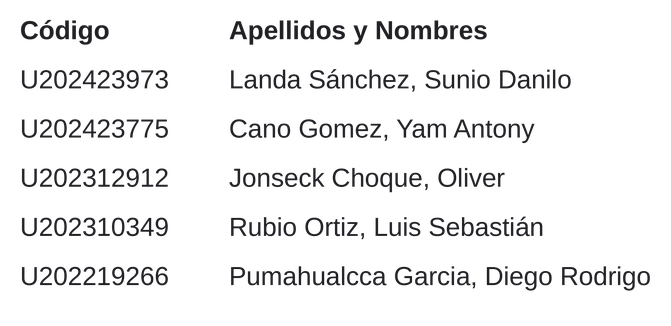
</picture>

**Período 202620**
<h3>Setiembre 2026</h3>

---

# Registro de Versiones del Informe 

|Versión|Fecha|Autor|Fecha de modificación|
|:------|:----|:----|:--------------------|
|||||

# Project Report Collaboration Insights 

# Contenido 

## Tabla de contenidos 
- [Registro de Versiones del Informe](#registro-de-versiones-del-informe)
- [Project Report Collaboration Insights](#project-report-collaboration-insights)
- [Contenido](#contenido)
  - [Tabla de contenidos](#tabla-de-contenidos)
- [Student Outcome](#student-outcome)
- [Capítulo I: Introducción](#capítulo-i-introducción)
  - [1.1. Startup Profile](#11-startup-profile)
    - [1.1.1. Descripción de la Startup](#111-descripción-de-la-startup)
    - [1.1.2. Perfiles de integrantes del equipo](#112-perfiles-de-integrantes-del-equipo)
  - [1.2. Solution Profile](#12-solution-profile)
    - [1.2.1 Antecedentes y problemática](#121-antecedentes-y-problemática)
    - [1.2.2 Lean UX Process.](#122-lean-ux-process)
      - [1.2.2.1. Lean UX Problem Statements.](#1221-lean-ux-problem-statements)
      - [1.2.2.2. Lean UX Assumptions.](#1222-lean-ux-assumptions)
      - [1.2.2.3. Lean UX Hypothesis Statements.](#1223-lean-ux-hypothesis-statements)
      - [1.2.2.4. Lean UX Canvas.](#1224-lean-ux-canvas)
  - [1.3. Segmentos objetivo.](#13-segmentos-objetivo)
- [Capítulo II: Requirements Elicitation \& Analysis](#capítulo-ii-requirements-elicitation--analysis)
  - [2.1. Competidores.](#21-competidores)
    - [2.1.1. Análisis competitivo.](#211-análisis-competitivo)
    - [2.1.2. Estrategias y tácticas frente a competidores.](#212-estrategias-y-tácticas-frente-a-competidores)
  - [2.2. Entrevistas.](#22-entrevistas)
    - [2.2.1. Diseño de entrevistas.](#221-diseño-de-entrevistas)
    - [2.2.2. Registro de entrevistas.](#222-registro-de-entrevistas)
    - [2.2.3. Análisis de entrevistas.](#223-análisis-de-entrevistas)
  - [2.3. Needfinding.](#23-needfinding)
    - [2.3.1. User Personas.](#231-user-personas)
    - [2.3.2. User Task Matrix.](#232-user-task-matrix)
    - [2.3.3. User Journey Mapping.](#233-user-journey-mapping)
    - [2.3.4. Empathy Mapping.](#234-empathy-mapping)
  - [2.4. Big Picture EventStorming.](#24-big-picture-eventstorming)
  - [2.5. Ubiquitous Language.](#25-ubiquitous-language)
- [Capítulo III: Requirements Specification](#capítulo-iii-requirements-specification)
  - [3.1. User Stories](#31-user-stories)
  - [3.2. Impact Mapping.](#32-impact-mapping)
  - [3.3. Product Backlog.](#33-product-backlog)
- [Capítulo IV: Product Design](#capítulo-iv-product-design)
  - [4.1. Style Guidelines.](#41-style-guidelines)
    - [4.1.1. General Style Guidelines.](#411-general-style-guidelines)
    - [4.1.2. Web Style Guidelines.](#412-web-style-guidelines)
  - [4.2. Information Architecture.](#42-information-architecture)
    - [4.2.1. Organization Systems.](#421-organization-systems)
    - [4.2.2. Labeling Systems.](#422-labeling-systems)
    - [4.2.3. SEO Tags and Meta Tags](#423-seo-tags-and-meta-tags)
    - [4.2.4. Searching Systems.](#424-searching-systems)
    - [4.2.5. Navigation Systems.](#425-navigation-systems)
  - [4.3. Landing Page UI Design.](#43-landing-page-ui-design)
    - [4.3.1. Landing Page Wireframe.](#431-landing-page-wireframe)
    - [4.3.2. Landing Page Mock-up.](#432-landing-page-mock-up)
  - [4.4. Web Applications UX/UI Design.](#44-web-applications-uxui-design)
    - [4.4.1. Web Applications Wireframes.](#441-web-applications-wireframes)
    - [4.4.2. Web Applications Wireflow Diagrams.](#442-web-applications-wireflow-diagrams)
    - [4.4.3. Web Applications Mock-ups.](#443-web-applications-mock-ups)
    - [4.4.4. Web Applications User Flow Diagrams.](#444-web-applications-user-flow-diagrams)
  - [4.5. Web Applications Prototyping.](#45-web-applications-prototyping)
  - [4.6. Domain-Driven Software Architecture.](#46-domain-driven-software-architecture)
    - [4.6.1. Design-Level EventStorming.](#461-design-level-eventstorming)
    - [4.6.2. Software Architecture Context Diagram.](#462-software-architecture-context-diagram)
    - [4.6.3. Software Architecture Container Diagrams.](#463-software-architecture-container-diagrams)
    - [4.6.4. Software Architecture Components Diagrams.](#464-software-architecture-components-diagrams)
  - [4.7. Software Object-Oriented Design.](#47-software-object-oriented-design)
    - [4.7.1. Class Diagrams.](#471-class-diagrams)
  - [4.8. Database Design.](#48-database-design)
    - [4.8.1. Database Diagrams.](#481-database-diagrams)
- [Capítulo V: Product Implementation, Validation \& Deployment](#capítulo-v-product-implementation-validation--deployment)
  - [5.1. Software Configuration Management.](#51-software-configuration-management)
    - [5.1.1. Software Development Environment Configuration.](#511-software-development-environment-configuration)
    - [5.1.2. Source Code Management.](#512-source-code-management)
    - [5.1.3. Source Code Style Guide \& Conventions.](#513-source-code-style-guide--conventions)
    - [5.1.4. Software Deployment Configuration.](#514-software-deployment-configuration)
  - [5.2. Landing Page, Services \& Applications Implementation.](#52-landing-page-services--applications-implementation)
    - [5.2.X. Sprint n](#52x-sprint-n)
      - [5.2.X.1. Sprint Planning n.](#52x1-sprint-planning-n)
      - [5.2.X.2. Aspect Leaders and Collaborators.](#52x2-aspect-leaders-and-collaborators)
      - [5.2.X.3. Sprint Backlog n.](#52x3-sprint-backlog-n)
      - [5.2.X.4. Development Evidence for Sprint Review.](#52x4-development-evidence-for-sprint-review)
      - [5.2.X.5. Execution Evidence for Sprint Review.](#52x5-execution-evidence-for-sprint-review)
      - [5.2.X.6. Services Documentation Evidence for Sprint Review.](#52x6-services-documentation-evidence-for-sprint-review)
      - [5.2.X.7. Software Deployment Evidence for Sprint Review.](#52x7-software-deployment-evidence-for-sprint-review)
      - [5.2.X.8. Team Collaboration Insights during Sprint.](#52x8-team-collaboration-insights-during-sprint)
- [Conclusiones](#conclusiones)
- [Bibliografía](#bibliografía)
- [Anexos](#anexos)

# Student Outcome 

# Capítulo I: Introducción 

## 1.1. Startup Profile 

### 1.1.1. Descripción de la Startup
**GreenTech** es una pequeña empresa de reciente creación dentro del sector *AgTech* , destacada por su alto potencial innovador y tecnológico. Ya que nuestro modelo de negocio es altamente escalable y nuestro crecimiento está proyectado para ser exponencial, abarcando desde pequeños productores independientes hasta grandes asociaciones agrarias. 

Nacemos con el firme propósito de democratizar el acceso a la agricultura de precisión. Actualmente, el sector agrícola enfrenta un desafío crítico que es el monitoreo manual de las parcelas,ya que requiere una inversión insostenible de tiempo y esfuerzo físico, y suele detectar problemas cuando el daño en los cultivos es irreversible. Por otro lado, las tecnologías modernas que podrían solucionar esto se caracterizan por ser ecosistemas cerrados, de costos prohibitivos y sin opciones de modificación, dejando a gran parte de los productores en desventaja tecnológica y competitiva.

Ante este panorama, **GreenTech** se enfoca en el desarrollo de plataformas de software accesibles, automatizadas y personalizables que rompen con los monopolios del software comercial tradicional. Buscamos transformar la gestión del campo reemplazando las inspecciones manuales por recolección y análisis de datos de vanguardia. Nuestro objetivo es empoderar a los agricultores, ingenieros agrónomos y cooperativas, brindándoles las capacidades tecnológicas necesarias para identificar de manera temprana amenazas como el estrés hídrico, las plagas o las deficiencias de fertilizantes. Al impulsar la toma de decisiones basadas en datos precisos y diagnósticos visuales, no solo ayudamos a incrementar la rentabilidad de las cosechas, sino que promovemos prácticas agrícolas mucho más eficientes y sostenibles a largo plazo.

**Misión :**
Proveer a los productores agrícolas de soluciones tecnológicas accesibles y automatizadas para el monitoreo inteligente de sus parcelas, facilitando la detección temprana de anomalías y optimizando el uso de recursos críticos para lograr una agricultura más rentable y sostenible.

**Visión :**
Convertirnos en la empresa *AgTech* líder y referente en Latinoamérica, empoderando a agricultores y cooperativas de todos los tamaños mediante tecnología innovadora que elimine las barreras de entrada a la agricultura de precisión.

### 1.1.2. Perfiles de integrantes del equipo 

| **Integrante** | |
| :--- | :--- |
| **Código del Estudiante** | |
| **Carrera** | |
| **Descripción** | |
| **Foto** | |

--------------

| **Integrante** | Cano Gomez Yam Antony Gabriel |
| :--- | :--- |
| **Código del Estudiante** | U202423775 |
| **Carrera** | Ingeniería de Software |
| **Descripción** | |
| **Foto** | |

----------------------

| **Integrante** | Jonseck Choque Oliver |
| :--- | :--- |
| **Código del Estudiante** | U202312912 |
| **Carrera** | Ingeniería de Software |
| **Descripción** | Mi nombre es Oliver, poseo 21 años. Poseo mucho interés en la programación y llevo haciendo varios proyectos personales desde que ingrese a la universidad. No trabajo bajo contrato actualmente, pero trabajo cómo freelancer por periodos de tiempo. |
| **Foto** | |

---------------------

| **Integrante** | |
| :--- | :--- |
| **Código del Estudiante** | |
| **Carrera** | |
| **Descripción** | |
| **Foto** | |

---------------------

| **Integrante** | |
| :--- | :--- |
| **Código del Estudiante** | |
| **Carrera** | |
| **Descripción** | |
| **Foto** | |

## 1.2. Solution Profile 

### 1.2.1 Antecedentes y problemática 

| 5w & 2H | Descripcion|
|---------|------------|
| **What: ¿Cuál es el problema?**| El monitoreo agrícola manual requiere un alto costo de tiempo y esfuerzo físico, debido a la necesidad de supervisar extensas áreas de cultivo de manera constante. A esto se suma la falta de acceso a software comercial de automatización de vuelos de drones y análisis de imágenes agrícolas, debido a su alto costo y naturaleza cerrada, lo que limita la posibilidad de contar con soluciones personalizables y obliga a los agricultores a depender de procesos manuales poco eficientes.|
| **When: ¿Cuándo sucede este problema?**| Durante las revisiones periódicas del terreno, siendo especialmente crítico cuando las plagas, el estrés hídrico o las deficiencias de fertilizante avanzan rápidamente sin ser detectados a tiempo.|
| **Where: ¿Dónde se produce este suceso?** | A lo largo de parcelas y grandes extensiones de terrenos agrícolas, donde la escala del campo hace que las inspecciones humanas sean logísticamente ineficientes.|
| **Who: ¿Quiénes están involucrados?** | Los productores y agricultores que deben gestionar los cultivos, así como el personal encargado de la inspección física en el campo.|
| **Why: ¿Cuál es la causa del problema?** | Las alternativas tecnológicas actuales operan como ecosistemas cerrados y rígidos. Al no integrarse con las dinámicas y necesidades agronómicas específicas de cada cultivo, resultan inoperantes para el entorno real del productor, forzándolo a depender de las inspecciones físicas tradicionales. |
| **How: ¿Qué llevó a la persona a llegar a esta situación?** | Se manifiesta a través del monitoreo manual de las parcelas agrícolas, un proceso que requiere de mucho tiempo y esfuerzo físico, y que a menudo no detecta problemas hasta que están muy avanzados|
| **How Much: ¿Cuánto es el impacto financiero?** | Representa grandes pérdidas de cultivos por la identificación tardía de anomalías, además de los altos costos incurridos en la cantidad de horas  necesarias de un trabajador para recorrer la parcela físicamente.|

### 1.2.2 Lean UX Process. 

#### 1.2.2.1. Lean UX Problem Statements. 
*El estado actual del dominio del monitoreo agrícola se ha centrado principalmente en inspecciones manuales lentas y que demandan mucha mano de obra, realizadas sobre las parcelas por pequeños y medianos productores y los ingenieros agrónomos que los asesoran, y que a menudo detectan los problemas cuando el daño ya es irreversible. Lo que los productos existentes no logran abordar es la necesidad de una automatización de vuelos de drones y un análisis de imágenes accesibles, abiertos y personalizables, adaptados a las necesidades agronómicas específicas de estos usuarios, ya que las soluciones comerciales actuales son ecosistemas costosos y cerrados. Nuestro producto abordará esta brecha ofreciendo una plataforma por suscripción, compatible con drones comerciales estándar, que automatiza las rutas de vuelo y genera mapas visuales del terreno para identificar tempranamente el estrés de los cultivos, las plagas y las deficiencias de fertilizante. Nuestro enfoque inicial serán los pequeños y medianos productores agrícolas, ya sean independientes o asociados a cooperativas, y los ingenieros agrónomos que los asesoran. Sabremos que hemos tenido éxito cuando observemos una tasa de conversión del 25 % a nuestras suscripciones de pago (Básica, Profesional o Cooperativa) y un uso recurrente de la herramienta de mapeo durante los primeros 6 meses.*

#### 1.2.2.2. Lean UX Assumptions. 

**Business Assumptions:**
* Creemos que los pequeños y medianos productores agrícolas y las cooperativas agrarias están dispuestos a pagar suscripciones (Básico, Profesional y Cooperativa) por una plataforma accesible que se adapte a las necesidades agronómicas específicas de sus terrenos.
* Creemos que nuestro modelo de negocio será altamente escalable al integrarse con drones comerciales estándar, evitando la necesidad de fabricar hardware propio.
* Creemos que existe un espacio en el mercado para una alternativa abierta, personalizable y de menor costo frente a otras soluciones comerciales
* Creemos que nuestro equipo cuenta con las capacidades técnicas necesarias para desarrollar la planificación automática de vuelos y el procesamiento de imágenes aéreas.

**Business Outcome Assumptions:**
* Creemos que lograremos una tasa de conversión del 25% hacia nuestras suscripciones de pago durante los primeros 6 meses.
* Creemos que al menos el 60% de los suscriptores de pago generará como mínimo un mapa del terreno al mes durante los primeros 6 meses, evidenciando un uso recurrente de la plataforma.
* Creemos que retendremos al menos al 70% de los suscriptores de pago después de los primeros 6 meses.

**User Assumptions:**
* Creemos que los agricultores (pequeños y medianos productores, independientes o asociados a cooperativas) supervisan sus parcelas mediante recorridos físicos y no cuentan con herramientas digitales de monitoreo.
* Creemos que los usuarios tienen acceso a drones comerciales (propios, de la cooperativa o de su ingeniero agrónomo), pero carecen de los conocimientos técnicos o de herramientas de software abiertas para automatizar sus vuelos.
* Creemos que los ingenieros agrónomos atienden varias parcelas o clientes a la vez y necesitan centralizar la información de todas ellas para diagnosticar con mayor rapidez.
* Creemos que los gestores de cooperativas coordinan a varios productores y equipos de trabajo sobre grandes extensiones de terreno.
* Creemos que los usuarios prefieren revisar datos consolidados desde una pantalla antes que realizar inspecciones físicas extenuantes y propensas a errores humanos.

**User Outcome and Benefit Assumptions:**
* Creemos que los usuarios desean detectar a tiempo el estrés hídrico, las plagas o las deficiencias de fertilizante, y que al lograrlo mitigarán la pérdida económica en sus cosechas.
* Creemos que los agricultores desean reducir el tiempo y el esfuerzo físico que dedican a recorrer sus parcelas, y que la plataforma les permitirá supervisarlas desde una pantalla.
* Creemos que los ingenieros agrónomos desean mejorar la precisión de sus diagnósticos y atender más parcelas en menos tiempo, apoyándose en mapas visuales e información histórica.
* Creemos que los gestores de cooperativas desean coordinar de forma colaborativa múltiples parcelas y equipos de trabajo, obteniendo una visión consolidada de toda la extensión.

**Feature Assumptions:**
* Creemos que la funcionalidad de **Planificación automatizada de rutas de vuelo** solucionará la necesidad de trazar y personalizar el recorrido del dron sobre áreas delimitadas sin requerir control manual intensivo.
* Creemos que la funcionalidad de **Generación de mapas visuales del terreno** satisfará la necesidad de procesar imágenes aéreas para resaltar anomalías y la salud general del cultivo.
* Creemos que la funcionalidad de **Análisis avanzado de imágenes** cruzará datos visuales de forma automatizada para diagnosticar problemas agronómicos específicos en los planes superiores.
* Creemos que la funcionalidad de **Historial de cultivos y reportes** respaldará la toma de decisiones mediante el almacenamiento seguro en la nube para comparar ciclos agrícolas estacionales.
* Creemos que la consola de **Gestión multiparcela y multiusuario** ayudará a las cooperativas a organizar de forma colaborativa grandes extensiones de tierra y múltiples equipos de trabajo.
  
#### 1.2.2.3. Lean UX Hypothesis Statements. 

**Hipótesis 1**

*Creemos que lograremos* una tasa de conversión del 25% hacia nuestras suscripciones de pago durante los primeros 6 meses
*Si* los agricultores, los ingenieros agrónomos y los gestores de cooperativas
*Alcanzan* una reducción del tiempo y del esfuerzo manual necesarios para planificar vuelos de drones sobre sus parcelas
*Con* la funcionalidad de Planificación automatizada de rutas de vuelo, que permite delimitar áreas y generar automáticamente rutas de vuelo personalizadas.

**Hipótesis 2**

*Creemos que lograremos* un uso mensual recurrente de la herramienta de mapeo por parte de al menos el 60% de nuestros suscriptores de pago
*Si* los agricultores, los ingenieros agrónomos y los gestores de cooperativas
*Alcanzan* una visualización más rápida y comprensible del estado de sus cultivos y del terreno
*Con* la funcionalidad de Generación de mapas visuales del terreno, que procesa imágenes aéreas y genera mapas visuales que resaltan anomalías en los cultivos.

**Hipótesis 3**

*Creemos que lograremos* una mayor adopción de las suscripciones Profesional y Cooperativa
*Si* los ingenieros agrónomos y los gestores de cooperativas
*Alcanzan* una identificación más temprana de problemas agronómicos como el estrés de los cultivos, las plagas y las deficiencias de fertilizante
*Con* la funcionalidad de Análisis avanzado de imágenes, que analiza automáticamente las imágenes aéreas para identificar anomalías visuales relevantes.

**Hipótesis 4**

*Creemos que lograremos* una tasa de retención del 70% de los suscriptores de pago después de los primeros 6 meses
*Si* los agricultores, los ingenieros agrónomos y los gestores de cooperativas
*Alcanzan* decisiones mejor informadas al comparar las condiciones históricas de los cultivos con la información de monitoreos anteriores
*Con* la funcionalidad de Historial de cultivos y reportes, que almacena de forma segura la información de monitoreo en la nube y permite comparar entre ciclos agrícolas.

**Hipótesis 5**

*Creemos que lograremos* una mayor tasa de conversión hacia la suscripción Cooperativa
*Si* los gestores de cooperativas y sus equipos
*Alcanzan* una gestión colaborativa más eficiente de múltiples parcelas y usuarios
*Con* la consola de Gestión multiparcela y multiusuario, que permite a las cooperativas organizar múltiples áreas agrícolas y trabajar de forma colaborativa con distintos miembros del equipo.

#### 1.2.2.4. Lean UX Canvas. 
Figura 1
Lean UX Canvas — SkyCrop

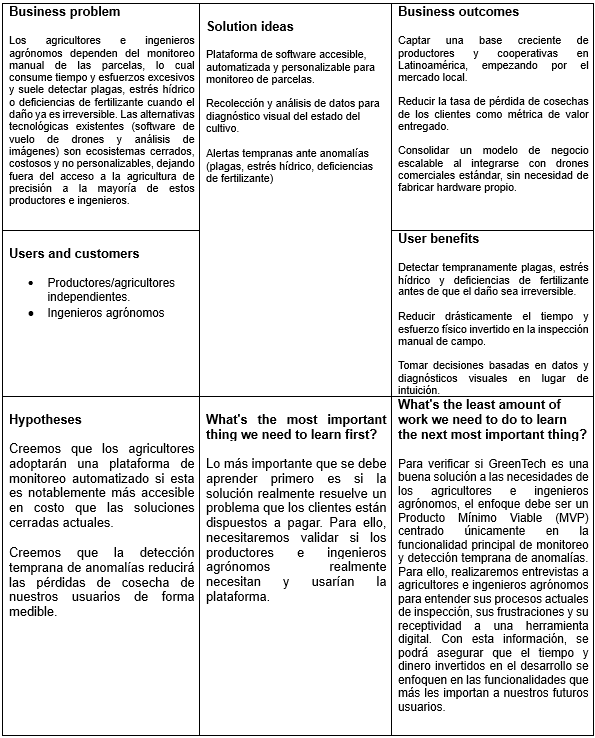

## 1.3. Segmentos objetivo. 

**Segmento Objetivo 1: Agricultores**
**Aspectos demográficos:**
- **Edad:** 25 - 55 años.
- **Nivel socioeconómico:** Media - Baja.
- **Tipo de productor:** Pequeños y medianos productores agrícolas, independientes o asociados a cooperativas.
- **Rubro:** Cultivo de productos agrícolas.
- **Nivel de necesidad:** Alta dependencia del monitoreo constante de sus parcelas para prevenir pérdidas.

**Aspectos geográficos:**
- **Nacionalidad:** Peruana.
- **Zona geográfica:** Rural.

**Aspectos psicográficos:**
- **Motivación:** Evitar pérdidas de cosecha por detección tardía de plagas, estrés hídrico o deficiencias de fertilizante; reducir el esfuerzo físico de la inspección manual.
- **Valores:** La productividad, el ahorro de recursos y la sostenibilidad de sus cultivos.
- **Intereses:** Adopción de tecnología accesible que no requiera grandes inversiones ni conocimientos técnicos avanzados.

---------------

**Segmento Objetivo 2: Ingenieros agrónomos**
**Aspectos demográficos:**
- **Edad:** 23 - 45 años.
- **Nivel socioeconómico:** Media - Alta.
- **Tipo de perfil:** Profesionales independientes o vinculados a cooperativas u asociaciones agrarias.
- **Rubro:** Asesoría técnica y gestión agronómica de cultivos.
- **Nivel de necesidad:** Alta demanda de herramientas de diagnóstico eficientes para atender múltiples parcelas o clientes.

**Aspectos geográficos:**
- **Nacionalidad:** Peruana.
- **Zona geográfica:** Rural / semi-urbana.

**Aspectos psicográficos:**
- **Motivación:** Optimizar su tiempo de supervisión en campo, mejorar la precisión de sus diagnósticos y la calidad de su asesoría técnica.
- **Valores:** El rigor técnico, la eficiencia y la toma de decisiones basada en datos.
- **Intereses:** Herramientas digitales que centralicen información de múltiples parcelas y faciliten diagnósticos visuales confiables.

# Capítulo II: Requirements Elicitation & Analysis 

## 2.1. Competidores. 

Hemos identificado a tres empresas con ofertas similares a la de nuestra startup:

- **Pix4D**: Es una empresa de software de fotogrametría, ofrece varios programas bajo licencia para usarse en varias industrias como en la agricultura. Uno de sus productos es Pix4D fields, un software híbrido de mapeo con drones para el análisis de cultivos y agricultura precisa. 
- **DJI Enterprise**: Es una empresa que ofrece drones y software para drones. Uno de sus programas es DJI Terra, el cual consiste en la reconstrucción de terrenos para la adquisición y procesamiento de datos. Este programa es aplicable a la agricultura, permitiendo programar rutas de vuelo y generar mapas de vegetación para obtener información sobre la salud y crecimiento de los cultivos.
- **Geodrone**: Es una empresa perteneciente al grupo RCP que se basa en la provisión de servicios con drones para inspecciones, limpiezas, captura de datos, agricultura, entre otros. Esta empresa además permite fabricar drones personalizados basándose en necesidades operativas. En su servicio de agricultura, la empresa ofrece análisis de cultivos para la generación de mapas NDVI, de cobertura vegetal o de elevación. Además ofrece riego, control de plagas o cosechas mediante drones.

### 2.1.1. Análisis competitivo. 

<table border="1">
  <tr>
    <th colspan="6">Competitive Analysis Landscape</th>
  </tr>
  <tr>
    <th colspan="2">¿Por qué llevar a cabo este análisis?</th>
    <td colspan="4">
      El objetivo de este analisis es conocer más sobre lo que ofrece nuestra competencia para, en base a ello, identificar en que aspectos podemos diferenciarnos y como podemos mejorar nuestro producto. Con estos avances podremos tener un mejor puesto en el mercado.
    </td>
  </tr>
  
  <tr>
  <tr>
    <th colspan="2" rowspan="2">Empresa</th>
    <th>SkyCrop</th>
    <th>Pix4D</th>
    <th>DJI Enterprise</th>
    <th>Geodrone</th>
  </tr>
  <tr>
    <td>
      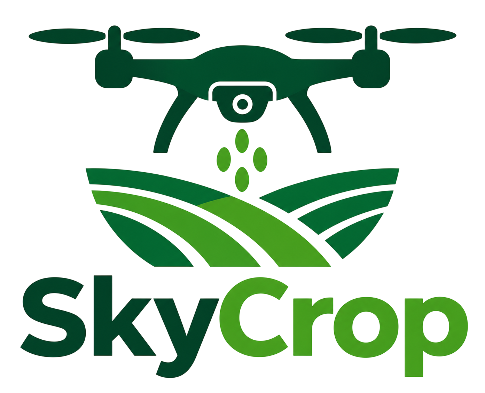
    </td>
    <td>
      
    </td>
    <td>
      
    </td>
    <td>
      
    </td>
  </tr>
  
  <tr>
  <th rowspan = "2">Perfil</th>
    <th>Overview</th>
    <td>Plataforma de gestión y configuración de rutinas de vuelo para drones capaces de generar escaneos en terrenos agrícolas.
    </td>
    <td>Plataforma de venta de licencias de software para la obtención de datos, el análisis de cultivos, creación de mapas y guardado en la nube.
    </td>
    <td>Plataforma de venta de drones y de licencias de software apto para la agricultura, capaz de evaluar la salud de cultivos y generar mapas de vegetación.
    </td>
    <td>Plataforma de servicios de drones para la generación de mapas del terreno, seguimiento de cultivos y elaboración de informes agrícolas.
    </td>
  </tr>
  <tr>
    <th>Ventaja Competitiva</th>
    <td>Enfoque en la agricultura, compatibilidad con la mayoría de drones y almacenamiento de datos históricos y de reportes avanzados.
    </td>
    <td>Alta compatibilidad con la mayoría de drones y análisis avanzado a partir de imagenes para generar prescripciones.
    </td>
    <td>Elaboración y venta de drones especializados en la agricultura junto con un programa de análisis y procesamiento.
    </td>
    <td>Servicios realizados con operadores altamente capacitados, generando varios resultados de alta calidad.
    </td>
  </tr>

  <tr>
  <th rowspan = "2">Perfil de Marketing</th>
    <th>Mercado Objetivo</th>
    <td>Agricultores e Ingenieros agrónomos.
    </td>
    <td>Arquitectos, agricultores, topógrafos, ingenieros, entre otros.
    </td>
    <td>Personal de seguridad pública, agricultores, mineros, arquitectos, entre otros.
    </td>
    <td>Ingenieros civiles, agricultores, inspectores, personal de seguridad, entre otros.
    </td>
  </tr>
  <tr>
    <th>Estrategias de Marketing</th>
    <td>Publicación del producto en redes sociales, demostración de casos de exito y alianzas con agrónomos y empresas.
    </td>
    <td>Demostraciones del software y sus resultados, además del ofrecimiento de pruebas gratuitas.
    </td>
    <td>Presentación de casos de uso, publicación de noticias en redes sociales y ofrecimiento de pruebas gratuitas.
    </td>
    <td>Demostraciones de servicios y sus beneficios, publicación de casos de exito y participación en eventos industriales.
    </td>
  </tr>

  <tr>
  <th rowspan = "3">Perfil de Producto</th>
    <th>Productos & Servicios</th>
    <td>Plataforma que programa rutinas de vuelo, escaneos del terreno y emisión de alertas. Se acompaña de un servicio de guardado en la nube para registrar datos históricos y reportes.
    </td>
    <td>Aplicación de escaneo y mapeo del terreno para el análisis de los cultivos. Permite compartir y guardar datos o informes mediante un servicio en la nube.
    </td>
    <td>Software integrable en drones para la reconstruccion de terrenos en 3D y la generación de mapas de indices de vegetación como NDVI o NDRE.
    </td>
    <td>Servicio de análisis de cultivos, generación de mapas, riego, control de plagas o cosecha mediante drones.
    </td>
  </tr>
  <tr>
    <th>Precios & Costos</th>
    <td>Subscripciones mensuales y anuales a partir de $40.
    </td>
    <td>Prueba gratuita y subscripciones mensuales o anuales a partir de $165.
    </td>
    <td>Prueba gratuita y planes anuales a partir de $300.
    </td>
    <td>Cotizable segun servicio.
    </td>
  </tr>
    <tr>
    <th>Canales de Distribución</th>
    <td>Mediante aplicación web y aplicación movil
    </td>
    <td>Mediante sitio web
    </td>
    <td>Mediante sitio web y aplicación movil
    </td>
    <td>Mediante sitio web
    </td>
  </tr>

  <tr>
  <th rowspan = "4">Análisis SWOT</th>
    <th>Fortalezas</th>
    <td>Plataforma web accesible desde cualquier dispositivo, guardado de datos históricos en la nube y alta compatibilidad con drones.
    </td>
    <td>Software especializado para diferentes industrias como en la agricultura. Además, tiene un alto rango de sistemas compatibles.
    </td>
    <td>Amplio ecosistema de drones y softwares, además de programas de alta tecnología.
    </td>
    <td>Servicios de alta calidad adaptables a las necesidades de los clientes y alta experiencia en el mercado
    </td>
  </tr>
  <tr>
    <th>Debilidades</th>
    <td>Dependencia de conectividad a la nube para el procesamiento y falta de reconocimiento de la startup.
    </td>
    <td>Alto precio de la aplicación y necesidad de capacitación.
    </td>
    <td>Alto precio de la aplicación y menor enfoque en cuanto a agricultura.
    </td>
    <td>Costo recurrente para los clientes que requieran monitoreo constante.
    </td>
  </tr>
    <tr>
    <th>Oportunidades</th>
    <td>Plataforma diseñada para ser accesible y con mayor enfoque en la agricultura.
    </td>
    <td>Aprovechamiento de las funciones offline en campos de cultivo sin internet o señal, así como el uso eficiente de los insumos ante posibles subidas de precio.
    </td>
    <td>Gran reconocimiento en diferentes industrias y posibles ventas cruzadas con dron y software.
    </td>
    <td>Ahorro para el agricultor al eliminar el costo de adquisición de drones cuyo precio va en aumento.
    </td>
  </tr>
    <tr>
    <th>Amenazas</th>
    <td>Competencia con plataformas similares con mayor experiencia en el mercado.
    </td>
    <td>Las subscripciones de alto precio que ofrece pueden alejar a empresas agricolas pequeñas.
    </td>
    <td>Sus planes de alto precio, así como la complejidad del software, pueden alejar a empresas agricolas pequeñas.
    </td>
    <td>Posibles problemas con la disponibilidad de los proveedores de servicios.
    </td>
  </tr>
</table>

### 2.1.2. Estrategias y tácticas frente a competidores. 

Luego de realizar el análisis de nuestra competencia, nos proponemos las siguientes estrategias para tener un mejor puesto en el mercado:

- **Mayor enfoque en la agricultura:** Mientras que las empresas de nuestros competidores abarcan diferentes ámbitos como en construcciones, seguridad pública o inspecciones, nuestro producto estará enfocado en la agricultura, por lo cual realizaremos un mayor esfuerzo conociendo las necesidades que haya en este ámbito para proponer soluciones valiosas para nuestro segmento objetivo.
- **Ofrecer diferentes tipos de subscripciones:** Los productos de Pix4D y DJI Enterprise cuentan con una subscripción costosa para acceder a todas las funcionalidades que tienen para ofrecer. Un agricultor o ingeniero agrónomo que no haya usado tales aplicaciones previamente habría pagado un precio adicional por funciones sin utilizar. Frente a esto, consideramos dividir nuestras futuras funcionalidades en diferentes tipos de subscripciones, con el fin de ofrecer lo más básico, útil y utilizado a un precio accesible y ofrecer lo más avanzado pero igual de útil a mayores precios.
- **Desarrollar funciones sin conexión:** Para que nuestra solución no pierda su valor ante los inconvenientes presentes en campos agrícolas, como la falta de conexión, vemos esencial que la aplicación SkyCrop tenga una serie de funciones utiles accesibles sin conexión. Esto lo identificamos al observar las soluciones ofrecidas por Pix4D y DJI Enterprise, las cuales cuentan con funciones similares, y al analizar los problemas que pueden tener los servicios de Geodrone respecto a disponibilidad.

## 2.2. Entrevistas. 

### 2.2.1. Diseño de entrevistas. 

Las entrevistas consistirán de una serie de preguntas principales dirigidas a los segmentos objetivos junto con otras preguntas complementarias que nos brinden información adicional. 
Antes de que comience la entrevista, explicaremos nuestra solución a los entrevistados con el fin de brindar contexto.
Al comenzar la entrevista, se realizarán preguntas cortas para recaudar información básica del entrevistado, como su nombre, edad y distrito de residencia. Luego de esto, se realizarán las preguntas principales.

**Preguntas para el segmento 1: Agricultores**

1. ¿Cómo es el terreno donde cultiva? ¿Cómo lo monitorea?
2. ¿Qué herramientas suele usar para el monitoreo? ¿Qué información obtienes?
3. ¿Cuál es la mayor dificultad que enfrenta al realizar el monitoreo? ¿Qué otras dificultades encuentra? 
4. ¿Qué problemas suele encontrar en su cultivo? Cuéntenos como los suele resolver.
5. ¿Qué información de sus cultivos le gustaría conocer de forma sencilla?
6. ¿Alguna vez ha usado drones agrícolas u otras tecnologías? Cuéntenos sobre su experiencia y como las ha usado.
7. ¿Qué piensa que debería ser capaz de hacer un dron agrícola para que le sea útil en su trabajo?
8. Imagina un sistema que gestione a los drones que podría haber en tu terreno, ¿Qué espera que pudiera hacer tal sistema?
9. En este caso, el sistema obtiene información de los drones que realizan escaneos de sus cultivos, ¿Cómo le gustaría recibir y visualizar aquella información?
10. ¿Qué problemas piensa que tendría ese sistema en su terreno?
11. ¿Qué funcionalidades piensa que debería tener aquel sistema para que usted pague por ella para usarla en su trabajo?

**Preguntas para el segmento 2: Ingenieros Agrónomos**

1. ¿Qué cultivos y terrenos suele asesorar? Cuéntenos sobre ellos.
2. ¿Cómo monitorea los cultivos? ¿Qué información obtiene?
3. ¿Qué datos o indicadores considera importantes a la hora de evaluar un cultivo?
4. ¿Qué dificultades en su trabajo suele encontrar al asesorar cultivos o terrenos?
5. ¿Qué problemas del cultivo considera que se deberían detectar a tiempo? ¿Usted como los detecta?
6. ¿Qué información le gustaría obtener mediante drones agrícolas? ¿Cómo le ayudaría tal información?
7. ¿Cómo le gustaría que se le presente la información obtenida?
8. Imagine un sistema que controle a tales drones agrícolas, le ayude a planificar rutinas de vuelo y muestre la información recogida, ¿Qué factores tendría en cuenta para decidir si lo usaría en su trabajo?
9. ¿Qué trabajos dejaría que el sistema hiciera automáticamente y cuáles los haría manualmente?
10. ¿Qué funcionalidades piensa que debería tener el sistema para que pague por él y lo incorpore en su trabajo?

### 2.2.2. Registro de entrevistas. 
*Registro de entrevistas — Segmento 1*

**Entrevista 1**

| Campo | Detalle                                                                                                                                                                                                                                                                                                                                                                                                                                                                                                                                                                                                                                                                                                                                                                                                                                                                                                                                                                                                                                                                                                                                                                                                                                                                                                                 |
| :--- |:------------------------------------------------------------------------------------------------------------------------------------------------------------------------------------------------------------------------------------------------------------------------------------------------------------------------------------------------------------------------------------------------------------------------------------------------------------------------------------------------------------------------------------------------------------------------------------------------------------------------------------------------------------------------------------------------------------------------------------------------------------------------------------------------------------------------------------------------------------------------------------------------------------------------------------------------------------------------------------------------------------------------------------------------------------------------------------------------------------------------------------------------------------------------------------------------------------------------------------------------------------------------------------------------------------------------|
| **Nombre** | Drago Duarte                                                                                                                                                                                                                                                                                                                                                                                                                                                                                                                                                                                                                                                                                                                                                                                                                                                                                                                                                                                                                                                                                                      |
| **Edad** | 26 años                                                                                                                                                                                                                                                                                                                                                                                                                                                                                                                                                                                                                                                                                                                                                                                                                                                                                                                                                                                                                                                                                                             |
| **Distrito** | Huancayo                                                                                                                                                                                                                                                                                                                                                                                                                                                                                                                                                                                                                                                                                                                                                                                                                                                                                                                                                                                                                                                                                                        |
| **Duración** | 6:56 min                                                                                                                                                                                                                                                                                                                                                                                                                                                                                                                                                                                                                                                                                                                                                                                                                                                                                                                                                                                                                                                                                                        |
| **Enlace** | [Entrevista](https://upcedupe-my.sharepoint.com/:v:/g/personal/u202423775_upc_edu_pe/IQDJE97sKJy4QJL1mG9r9brlAa9gDSSq7TTjgAmJ_qvrnxQ?nav=eyJyZWZlcnJhbEluZm8iOnsicmVmZXJyYWxBcHAiOiJPbmVEcml2ZUZvckJ1c2luZXNzIiwicmVmZXJyYWxBcHBQbGF0Zm9ybSI6IldlYiIsInJlZmVycmFsTW9kZSI6InZpZXciLCJyZWZlcnJhbFZpZXciOiJNeUZpbGVzTGlua0NvcHkifX0&e=mG4q5Q) |

**Resumen**:  
En esta entrevista, Drago, un agricultor que gestiona una parcela mediana en una zona rural, comparte los desafíos diarios del campo. Destaca que el mayor problema actual es el alto costo de tiempo y el gran esfuerzo físico que requiere el monitoreo manual, lo que provoca que detecte problemas críticos como el estrés hídrico, plagas y falta de fertilizantes cuando el daño ya es irreversible. También menciona que no aprovecha los drones por su falta de conocimientos en programación y porque el software comercial es muy costoso e inflexible. Explica que le gustaría visualizar la salud de su cultivo de forma rápida y comprensible desde una pantalla para evitar recorrer el terreno a ciegas. Finalmente, describe su sistema ideal y afirma que pagaría una suscripción por una plataforma que genere rutas de vuelo automatizadas y mapas visuales de anomalías, resaltando que la herramienta debe estar preparada para lidiar con la conectividad intermitente a internet propia de las zonas rurales.

---
**Entrevista 2**

| Campo | Detalle |
| :--- | :--- |
| **Nombre** | Masaru Nikaido |
| **Edad** | 27 |
| **Distrito** | Huaral |
| **Duración** | Por completar |
| **Enlace** | Por completar |

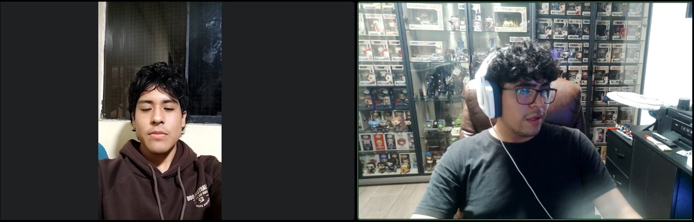

**Resumen**:
En esta entrevista, Masaru Nikaido comparte su experiencia en el monitoreo de sus cultivos, que realiza principalmente mediante recorridos presenciales y observación directa para identificar problemas de riego, plagas y enfermedades. Señala que una de sus principales dificultades es el tiempo que requiere revisar todo el terreno y detectar los problemas antes de que se agraven. Muestra interés en el uso de drones agrícolas que recorran el terreno automáticamente, recopilen información de los cultivos e identifiquen las zonas que necesitan atención. Asimismo, considera que un sistema de gestión de drones debería permitir programar recorridos, visualizar la información en un mapa sencillo, recibir alertas y consultar un historial del estado de los cultivos. Finalmente, indica que estaría dispuesto a pagar por una solución de este tipo si le permite ahorrar tiempo, detectar problemas de manera temprana y reducir posibles pérdidas en su producción.

---
**Entrevista 3**

| Campo | Detalle |
| :--- | :--- |
| **Nombre** | Higidio Pumahualcca |
| **Edad** | 61 |
| **Distrito** | Villa Maria del Triunfo |
| **Duración** | 7:22 min |
| **Enlace** | [Entrevista](https://upcedupe-my.sharepoint.com/:v:/g/personal/u202219266_upc_edu_pe/IQBZNqpJc52rQZjZbGbruBF3AXx6UrRnUWbUXMzME_DsSGM?e=tnRr3J&nav=eyJyZWZlcnJhbEluZm8iOnsicmVmZXJyYWxBcHAiOiJTdHJlYW1XZWJBcHAiLCJyZWZlcnJhbFZpZXciOiJTaGFyZURpYWxvZy1MaW5rIiwicmVmZXJyYWxBcHBQbGF0Zm9ybSI6IldlYiIsInJlZmVycmFsTW9kZSI6InZpZXcifX0%3D) |

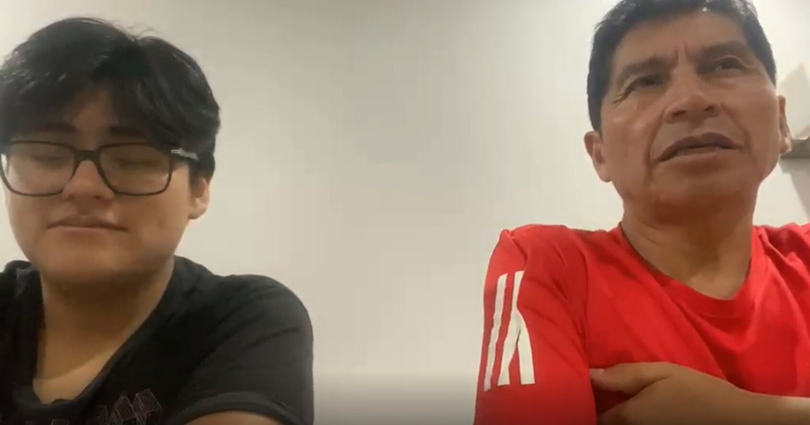

**Resumen**:
En esta entrevista, Higidio Pumahualcca comparte su experiencia y las formas que utiliza para realizar el monitoreo de sus cultivos. Actualmente, realiza principalmente recorridos presenciales y observación directa del terreno para identificar posibles problemas relacionados con las plagas y el riego. A partir de estas observaciones, verifica el estado de los cultivos y busca solucionar los problemas de acuerdo con su experiencia. Sin embargo, señala que esta actividad puede resultar cansada y que, en algunas ocasiones, presenta dificultades debido a la falta de tiempo para supervisar constantemente todo el terreno.
Asimismo, menciona que otro problema frecuente es la presencia de aves en determinadas zonas, ya que estas pueden alimentarse de los cultivos y ocasionar pérdidas en la producción. Ante esta situación, considera que sería de gran utilidad contar con un sistema que permita realizar un monitoreo constante de los cultivos mediante drones. También muestra interés en que los drones puedan contribuir a la seguridad de los cultivos, por ejemplo, detectando y ahuyentando a las aves cuando se aproximen a determinadas zonas.
Además, considera beneficioso que los drones puedan realizar otras actividades de manera automatizada, como el riego y la fumigación, especialmente cuando detecten que los cultivos requieren atención. Respecto al acceso a la información, señala que el celular sería el medio más conveniente para consultar el estado de sus cultivos y recibir información del sistema. También considera importante que los drones puedan funcionar sin conexión a Internet, debido a que en las zonas de cultivo suele existir poca o nula disponibilidad de Wi-Fi.
Finalmente, Higidio Pumahualcca manifiesta que estaría dispuesto a pagar por una solución que integre funciones de monitoreo, riego, fumigación y seguridad de los cultivos, especialmente si el sistema también permite detectar posibles pérdidas o problemas de manera anticipada. En general, muestra interés en una herramienta que le permita reducir el esfuerzo del monitoreo presencial, ahorrar tiempo y mejorar el control de sus cultivos.

---

*Registro de entrevistas — Segmento 2*

**Entrevista 1**

| Campo            | Detalle                                                                                                                                                                                                                                                                                                                      |
|:-----------------|:-----------------------------------------------------------------------------------------------------------------------------------------------------------------------------------------------------------------------------------------------------------------------------------------------------------------------------|
| **Nombre**       | Yamil Tejada                                                                                                                                                                                                                                                                                                                 |
| **Edad**         | 25 años                                                                                                                                                                                                                                                                                                                      |
| **Departamento** | Apurtimac                                                                                                                                                                                                                                                                                                                    |
| **Duración**     | 4:53 min                                                                                                                                                                                                                                                                                                                     |
| **Enlace**       | [Entrevista](https://upcedupe-my.sharepoint.com/:v:/g/personal/u202423775_upc_edu_pe/IQANRnid8Q2qTqzgiSzDhOhjAVoy8OeP3wXISC2PYCEKAYk?nav=eyJyZWZlcnJhbEluZm8iOnsicmVmZXJyYWxBcHAiOiJPbmVEcml2ZUZvckJ1c2luZXNzIiwicmVmZXJyYWxBcHBQbGF0Zm9ybSI6IldlYiIsInJlZmVycmFsTW9kZSI6InZpZXciLCJyZWZlcnJhbFZpZXciOiJNeUZpbGVzTGlua0NvcHkifX0&e=BL5eQD)|

**Resumen**:  
Yamil, un ingeniero agrónomo de 25 años que vive en apurimac,el  comparte sus conocimientos y desafíos al asesorar parcelas agrícolas y cooperativas. Destaca que su mayor dificultad es el tiempo que toma supervisar físicamente el campo para poder realizar diagnósticos agronómicos a tiempo, buscando identificar problemas como el estrés hídrico y las plagas. Menciona que las tecnologías modernas, como el análisis de imágenes aéreas, suelen tener precios prohibitivos o están restringidas a hardware específico, limitando su adopción. Explica que le gustaría usar un sistema que le permita trazar rutas de vuelo automáticas para drones estándar y cruzar datos visuales de las anomalías para optimizar sus tiempos de revisión. Finalmente, describe un plan ideal por el cual pagaría de forma profesional, el cual debería incluir reportes estacionales en la nube, un historial para comparar ciclos y una herramienta administrativa para gestionar el monitoreo colaborativo en múltiples terrenos.

---
**Entrevista 2**

| Campo            | Detalle                                                                                                                                                                                                                                                                                                                      |
|:-----------------|:-----------------------------------------------------------------------------------------------------------------------------------------------------------------------------------------------------------------------------------------------------------------------------------------------------------------------------|
| **Nombre**       | Ana Patricio                                                                                                                                                                                                                                                                                                                 |
| **Edad**         | 25 años                                                                                                                                                                                                                                                                                                                      |
| **Departamento** | Cusco                                                                                                                                                                                                                                                                                                                        |
| **Duración**     | 5:06 min                                                                                                                                                                                                                                                                                                                     |
| **Enlace**       | [Entrevista](https://upcedupe-my.sharepoint.com/:v:/g/personal/u202423775_upc_edu_pe/IQBdZ5wsRcLAT474EJ-DhFrMATsyQPF2viFsecxTayiaq4o?nav=eyJyZWZlcnJhbEluZm8iOnsicmVmZXJyYWxBcHAiOiJPbmVEcml2ZUZvckJ1c2luZXNzIiwicmVmZXJyYWxBcHBQbGF0Zm9ybSI6IldlYiIsInJlZmVycmFsTW9kZSI6InZpZXciLCJyZWZlcnJhbFZpZXciOiJNeUZpbGVzTGlua0NvcHkifX0&e=mZbm4k) |

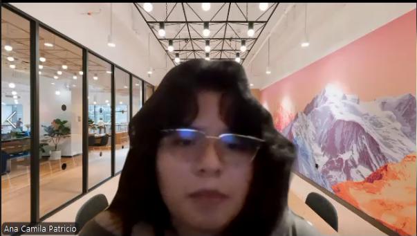

**Resumen**:  
En esta entrevista, Ana Camila Patricio, una ingeniera agrónoma de 25 años residente en Cusco, comparte sus desafíos al brindar asesoría técnica a pequeños productores y cooperativas agrarias. Destaca que su mayor frustración es la imposibilidad de estar en todas las parcelas a la vez y el gran desgaste físico que supone realizar inspecciones a pie bajo el sol, ya que solo puede procesar realmente la información cuando llega a su laptop. También menciona que, si bien conoce tecnologías para detectar problemas como el estrés hídrico o plagas a tiempo, las opciones comerciales actuales son ecosistemas cerrados con licencias carísimas. Explica que le urge una herramienta digital que funcione con drones estándar, que sea capaz de operar sin conexión a internet por la mala señal rural y que automatice la generación de mapas visuales, permitiéndole a ella enfocarse exclusivamente en tomar las decisiones. Finalmente, describe un sistema ideal por el cual pagaría un plan corporativo, el cual debe incluir un historial en la nube para comparar ciclos estacionales y una consola para gestionar colaborativamente múltiples parcelas y usuarios.

---
**Entrevista 3**

| Campo            | Detalle              |
|:-----------------|:---------------------|
| **Nombre**       | Suzy Vásquez Navarro |
| **Edad**         | 48 años              |
| **Departamento** | Ate                  |
| **Duración**     | 14:26 min            |
| **Enlace**       | [Entrevista](https://upcedupe-my.sharepoint.com/:v:/g/personal/u202423775_upc_edu_pe/IQBdZ5wsRcLAT474EJ-DhFrMATsyQPF2viFsecxTayiaq4o?nav=eyJyZWZlcnJhbEluZm8iOnsicmVmZXJyYWxBcHAiOiJPbmVEcml2ZUZvckJ1c2luZXNzIiwicmVmZXJyYWxBcHBQbGF0Zm9ybSI6IldlYiIsInJlZmVycmFsTW9kZSI6InZpZXciLCJyZWZlcnJhbFZpZXciOiJNeUZpbGVzTGlua0NvcHkifX0&e=mZbm4k) |

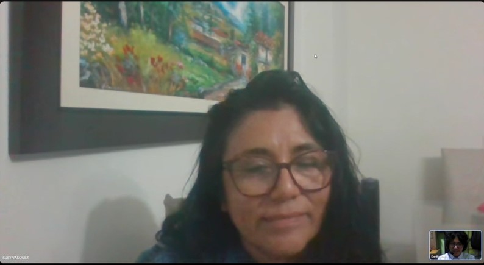

**Resumen**:  
Suzy Vásquez, de 48 años, es una ingeniera agrónoma que en esta entrevista nos cuenta sobre su trabajo. En su trabajo ella asesora a productores y agroexportadores, revisando varios cultivos con diferentes hortalizas de invierno o de verano.
Ella cuenta que el monitoreo de los cultivos que realiza depende de los clientes que asesora y del cultivo, algunos procesos que realiza es la toma de muestras, recorridos por el campo en diferentes formas, el control de plantas al azar por hectárea y la colocación de trampas para plagas. Los datos que suele recolectar son la humedad del suelo, la concentración de nutrientes, el pH, la etapa de desarrollo de los cultivos y el ambiente.
Nos cuenta también sus dificultades, tales como la resistencia de los clientes agricultores por sus costumbres, los casos donde no se realiza un estudio del suelo y lo largo que puede ser un monitoreo al trabajar con varias hectáreas.
La entrevistada no trabajó mucho con drones, pero contó que le gustaría que el sistema pueda capturar imágenes del campo con gran resolución, precisión y claridad, además de que pueda moverse a través de 10 o más hectáreas para tomar imágenes automáticamente y contar con otras funciones como aplicación de fertilizantes o riego.
En tales imágenes ella espera que se noten los manchados en los cultivos generados por diversos factores como el ambiente, estrés o plagas. Además, espera que se pueda visualizar como es el desarrollo de las plantas, su densidad por hectárea y la homogeneidad del riego.

---
### 2.2.3. Análisis de entrevistas. 

El análisis se elabora a partir de los datos y resúmenes del [registro de entrevistas](#222-registro-de-entrevistas), agrupados en los dos segmentos objetivo de SkyCrop: agricultores e ingenieros agrónomos. Se identifican características demográficas, prácticas actuales, dificultades, necesidades y expectativas para sustentar los arquetipos y orientar las decisiones de diseño.

**Base de análisis y criterio de interpretación**

Se consideran seis registros con resumen: tres de agricultores y tres de ingenieros agrónomos. Esta actualización incorpora la entrevista de Higidio Pumahualcca al análisis del primer segmento. Los códigos de la siguiente tabla permiten identificar la fuente de cada hallazgo dentro de esta sección; no representan entrevistas adicionales.

| Código | Segmento y registro de origen | Participante | Edad | Ubicación consignada en el registro |
| :--- | :--- | :--- | :--- | :--- |
| A1 | Agricultores, entrevista 1 | Drago Duarte | 26 años | Huancayo |
| A2 | Agricultores, entrevista 2 | Masaru Nikaido | 27 años | Huaral |
| A3 | Agricultores, entrevista 3 | Higidio Pumahualcca | 61 años | Villa María del Triunfo |
| G1 | Ingenieros agrónomos, entrevista 1 | Yamil Tejada | 25 años | Apurímac |
| G2 | Ingenieros agrónomos, entrevista 2 | Ana Patricio, nombrada Ana Camila Patricio en el resumen | 25 años | Cusco |
| G3 | Ingenieros agrónomos, entrevista 3 | Suzy Vásquez Navarro | 48 años | Ate |

Las ubicaciones se presentan como procedencia registrada, sin asumir que todas corresponden al mismo nivel geográfico. Es necesario precisar el distrito de los registros que solo identifican un departamento.

Para cada hallazgo se cuenta una sola vez cada registro cuyo resumen lo menciona explícitamente. El porcentaje se calcula como **registros que mencionan el hallazgo / registros disponibles del segmento × 100**, redondeado a un decimal cuando corresponde. Un mismo registro puede sustentar varios hallazgos, por lo que los porcentajes de las filas no se suman. La ausencia de una mención no se interpreta como rechazo, desconocimiento o ausencia de la necesidad.

Los resultados describen únicamente estos resúmenes y no constituyen estimaciones del mercado ni una revisión directa de las grabaciones. Con la incorporación de A3 se dispone de tres registros con resumen por segmento, alcanzando el mínimo solicitado para el análisis. Esto no cierra la verificación de las evidencias: siguen pendientes metadatos, enlaces y tiempos de las grabaciones.

**Segmento 1: agricultores — tres registros disponibles**

Los participantes registrados tienen 26, 27 y 61 años y proceden de Huancayo, Huaral y Villa María del Triunfo, respectivamente. Dos de los tres registros (66,7 %) corresponden a personas de 26 y 27 años y uno de tres (33,3 %) a una persona de 61 años. Esta última edad se encuentra fuera del rango inicial de 25 a 55 años indicado en la descripción del segmento, por lo que ese rango debe revisarse o justificarse sin excluir el testimonio de A3. Las edades y ubicaciones caracterizan a los participantes disponibles; no permiten establecer por sí solas el perfil demográfico de todos los agricultores a los que se dirige SkyCrop.

| Dimensión | Hallazgo identificado en los resúmenes | Registros de sustento | Frecuencia y porcentaje |
| :--- | :--- | :--- | :--- |
| Hábitos actuales | El monitoreo se realiza manualmente o mediante recorridos presenciales del terreno. | A1, A2, A3 | 3 de 3 (100 %) |
| Dificultades y frustraciones | El tiempo que requiere supervisar el terreno constituye una dificultad para el monitoreo. | A1, A2, A3 | 3 de 3 (100 %) |
| Necesidades de información | Se busca visualizar el estado del cultivo de forma sencilla para reconocer las zonas que necesitan atención. | A1, A2 | 2 de 3 (66,7 %) |
| Expectativas tecnológicas | Se expresa interés en automatizar recorridos o rutas de drones para monitorear los cultivos. | A1, A2 | 2 de 3 (66,7 %) |
| Barreras de adopción | El costo y la rigidez del software, junto con la falta de conocimientos de programación, limitan el aprovechamiento de drones. | A1 | 1 de 3 (33,3 %) |
| Conectividad | Se señala conectividad limitada en las zonas de cultivo y se solicita que la solución contemple esa condición. | A1, A3 | 2 de 3 (66,7 %) |
| Seguimiento | Se solicita recibir alertas y consultar un historial del estado de los cultivos. | A2 | 1 de 3 (33,3 %) |
| Dispositivo de consulta | Se identifica el celular como el medio más conveniente para consultar el estado de los cultivos y recibir información. | A3 | 1 de 3 (33,3 %) |
| Riesgos del cultivo | Se identifica la presencia de aves como causa de pérdidas y se propone detectarlas y ahuyentarlas con drones. | A3 | 1 de 3 (33,3 %) |
| Actividades adicionales | Se solicita automatizar riego y fumigación mediante drones. | A3 | 1 de 3 (33,3 %) |
| Disposición declarada de pago | Se manifiesta disposición a pagar por una solución con las capacidades descritas en cada resumen; en A3, la propuesta incluye monitoreo, riego, fumigación y seguridad. | A1, A2, A3 | 3 de 3 (100 %) |

El patrón compartido es la necesidad de reducir el tiempo de supervisión y conocer los problemas del cultivo oportunamente (A1, A2, A3). Para el diseño, esto orienta a presentar primero el estado de la parcela y la información que ayude a decidir dónde intervenir. A1 y A2 solicitan visualizaciones sencillas y automatización de recorridos; A3 aporta una preferencia explícita por consultar desde el celular. Su resumen no especifica mapas ni planificación de rutas, por lo que no se lo contabiliza en esas dos filas. Tampoco se puede concluir que los tres participantes sean propietarios de drones o tengan la misma experiencia tecnológica.

Las barreras de costo y conocimientos técnicos están documentadas en A1; el interés en alertas e historial, en A2. A1 y A3 mencionan problemas de conectividad, pero sus solicitudes tienen distinto alcance: A1 plantea que la herramienta contemple una conexión intermitente y A3 pide que los drones funcionen sin Internet. Esto no demuestra que exista una implementación offline ni que ambos describan el mismo funcionamiento técnico.

A3 amplía las necesidades identificadas con el control de aves, el riego y la fumigación. Estas solicitudes requieren evaluación de alcance y no se incorporan automáticamente como capacidades comprometidas de SkyCrop. Aunque los tres registros expresan disposición de pago, A3 la refiere a una solución que reúne esas funciones adicionales; no se puede asumir que pagaría por una oferta limitada al monitoreo. Ninguna de estas declaraciones acredita una compra, un precio aceptado o una tasa de conversión.

**Segmento 2: ingenieros agrónomos — tres registros disponibles**

Dos participantes tienen 25 años, equivalentes a 2 de 3 registros (66,7 %), y una participante tiene 48 años, equivalente a 1 de 3 (33,3 %). Las procedencias consignadas son Apurímac, Cusco y Ate. La inclusión de una participante de 48 años muestra que el rango inicial de 23 a 45 años indicado en la descripción del segmento debe revisarse o justificarse; no corresponde excluir sus respuestas del análisis por esa diferencia.

| Dimensión | Hallazgo identificado en los resúmenes | Registros de sustento | Frecuencia y porcentaje |
| :--- | :--- | :--- | :--- |
| Ocupación y contexto | Se asesora a productores agrícolas, cooperativas o agroexportadores en el seguimiento de cultivos. | G1, G2, G3 | 3 de 3 (100 %) |
| Dificultades de trabajo | El tiempo necesario para supervisar parcelas o extensiones de cultivo dificulta el monitoreo. | G1, G2, G3 | 3 de 3 (100 %) |
| Necesidades de información | Se expresa interés en imágenes o mapas que permitan identificar anomalías o evaluar el estado del cultivo. | G1, G2, G3 | 3 de 3 (100 %) |
| Barreras de adopción | Se señalan costos elevados o restricciones de las tecnologías disponibles para el análisis agrícola. | G1, G2 | 2 de 3 (66,7 %) |
| Automatización | Se solicita automatizar rutas, generación de mapas o captura de imágenes mediante drones. | G1, G2, G3 | 3 de 3 (100 %) |
| Seguimiento histórico | Se solicita un historial para comparar ciclos o información estacional de los cultivos. | G1, G2 | 2 de 3 (66,7 %) |
| Colaboración | Se plantea gestionar de manera colaborativa varios terrenos o usuarios. | G1, G2 | 2 de 3 (66,7 %) |
| Conectividad | Se solicita operar sin conexión ante la mala señal disponible en zonas rurales. | G2 | 1 de 3 (33,3 %) |
| Dispositivos | Se menciona el uso de laptop para procesar la información obtenida durante el trabajo de campo. | G2 | 1 de 3 (33,3 %) |
| Prácticas técnicas | Se describen toma de muestras, revisión de plantas, trampas para plagas y recolección de datos del suelo y del cultivo. | G3 | 1 de 3 (33,3 %) |
| Frustraciones de adopción | Se menciona la resistencia de algunos agricultores a modificar sus prácticas habituales. | G3 | 1 de 3 (33,3 %) |
| Disposición declarada de pago | Se expresa disposición a pagar por un plan con las capacidades descritas en el resumen. | G1, G2 | 2 de 3 (66,7 %) |

El objetivo compartido es contar con información que facilite la evaluación de cultivos atendidos profesionalmente (G1, G2, G3). Los reportes históricos y la colaboración entre usuarios reciben sustento específico de G1 y G2, por lo que orientan la propuesta de seguimiento de varias parcelas. El uso de laptop y la necesidad de operación sin conexión están documentados en G2; no se generalizan a todos los agrónomos entrevistados.

G3 aporta prácticas de observación y medición que ayudan a precisar qué información resulta útil: humedad del suelo, nutrientes, pH, etapa de desarrollo, manchas en plantas y homogeneidad del riego. Estas menciones expresan necesidades de evaluación agronómica; no prueban que todas esas variables puedan obtenerse de una imagen aérea ni que ya sean capacidades implementadas de SkyCrop. Su solicitud adicional de fertilización o riego mediante drones requiere evaluación de alcance y no se asume como un compromiso del producto.

**Relación de los hallazgos con los User Personas**

Los resultados permiten sustentar parte de las metas y dificultades de [Alfonso Román e Ignacio Rojas](#231-user-personas). Ambos son arquetipos utilizados para el diseño, no participantes adicionales de las entrevistas. La siguiente relación distingue los atributos respaldados de aquellos que todavía requieren evidencia.

| Arquetipo | Características que encuentran sustento en los registros | Fuentes | Aspectos de la ficha pendientes de sustento |
| :--- | :--- | :--- | :--- |
| Alfonso Román — agricultor | Necesidad de conocer el estado del cultivo y detectar riesgos oportunamente; dificultad por el tiempo de monitoreo; barreras de costo y conocimientos técnicos. El uso de celular para consultar información encuentra sustento en A3. | A1, A2 y A3 para monitoreo y detección; A1 para costo y conocimientos; A3 para consulta desde celular. | Edad de 36 años, procedencia de Huánuco, estado civil, composición familiar, ingreso de S/ 1500, marcas, navegadores, sistemas operativos, otros canales y puntuaciones de habilidades. La preferencia por celular está documentada solo en A3 y no valida el resto de los dispositivos o canales de la ficha. |
| Ignacio Rojas — ingeniero agrónomo | Asesoría a productores, necesidad de información para evaluar cultivos, dificultades por el tiempo de supervisión, barreras de acceso a tecnología y resistencia de algunos clientes a cambiar prácticas. | G1, G2 y G3 para asesoría e información; G1 y G2 para barreras tecnológicas; G3 para resistencia al cambio. | Edad de 26 años, procedencia de Áncash, estado civil, ingreso de S/ 2500, marcas, navegadores, sistemas operativos, preferencia general por canales y puntuaciones de habilidades. El uso de laptop solo está documentado en G2. |

Los resúmenes no permiten identificar marcas, navegadores, sistemas operativos o canales digitales predominantes en ninguno de los dos segmentos. El celular aparece como dispositivo de consulta preferido en A3 y la laptop como herramienta de trabajo en G2; ninguna mención demuestra una preferencia general del segmento ni el uso de aplicaciones concretas como WhatsApp. Tampoco se respaldan las etiquetas de personalidad ni los porcentajes de habilidades de las fichas. Esos atributos deben confirmarse mediante información recogida en las entrevistas o identificarse como decisiones de modelado pendientes de validación. La cifra «Mercado 50 %» de ambas fichas no se deriva de este análisis: disponer de tres registros por segmento tampoco demuestra una participación de mercado equivalente.

**Síntesis y actualización del análisis**

Ambos segmentos comparten dificultades por el tiempo de monitoreo e interés en obtener información del cultivo con apoyo de drones. En los registros de agricultores, el énfasis está en conocer el estado de sus cultivos y detectar problemas; A3 añade la consulta desde el celular y actividades adicionales que requieren delimitar el alcance. En los de agrónomos, se incorpora el contexto de asesorar a distintos productores y, en G1 y G2, comparar información histórica y colaborar en varios terrenos. Estas diferencias orientan la organización de las vistas y de la información, pero no bastan por sí solas para definir permisos exclusivos de cada rol.

La tercera entrevista de agricultores ya está incorporada y las frecuencias se calcularon sobre tres registros por segmento. Para cerrar la documentación de AV1 se deben completar los metadatos pendientes —entre ellos, la duración y el enlace de Masaru— y verificar los enlaces y tiempos de las grabaciones, incluido el enlace compartido por los registros de Ana y Suzy. También es necesario revisar los rangos de edad iniciales y ampliar los resúmenes con los datos realmente recogidos que sustenten los atributos aún no respaldados de las personas. Las conclusiones se mantienen como una síntesis de los registros textuales disponibles, sin afirmar representatividad del mercado ni resultados de validación del producto.

## 2.3. Needfinding. 

### 2.3.1. User Personas. 

Se presentan los arquetipos Alfonso Román, para agricultores, e Ignacio Rojas, para ingenieros agrónomos. Su propósito es orientar las decisiones de diseño según las actividades, metas y dificultades de ambos segmentos. Son representaciones compuestas para el proyecto y no corresponden a dos entrevistados adicionales.

La trazabilidad de sus características se establece a partir del [análisis de las seis entrevistas registradas](#223-análisis-de-entrevistas). Se utilizan los códigos A1–A3 para Drago Duarte, Masaru Nikaido e Higidio Pumahualcca, y G1–G3 para Yamil Tejada, Ana Patricio y Suzy Vásquez Navarro. Las menciones individuales se mantienen identificadas para evitar atribuir a todo un segmento una preferencia expresada por una sola persona.

**Relación con el análisis de la competencia**

La comparación de Pix4D, DJI Enterprise y Geodrone documentada en [2.1.1. Análisis competitivo](#211-análisis-competitivo) y las [estrategias propuestas en 2.1.2](#212-estrategias-y-tácticas-frente-a-competidores) aportan ejes para evaluar la propuesta: enfoque agrícola, costo de acceso, complejidad de uso, información del cultivo y continuidad ante conectividad limitada. Estos ejes se contrastan con los testimonios: A1 menciona barreras de costo y conocimientos; G1 y G2, costos y restricciones tecnológicas; A1, A3 y G2, dificultades de conectividad con solicitudes de distinto alcance.

Esta relación orienta propuestas de diseño, como presentar información comprensible, explicar las capacidades de cada plan y distinguir qué operaciones requieren conexión. No demuestra que los entrevistados usen las marcas comparadas ni valida precios, compatibilidad de equipos o ventajas comerciales de SkyCrop. Las características personales se sustentan en los registros de entrevistas; la comparación competitiva ayuda a evaluar cómo responder a sus necesidades.

**Estado de las fichas**

Las capturas de UXPressia corresponden a la versión de trabajo existente. Las tablas siguientes explican qué necesidades encuentran sustento y qué decisiones se proponen a partir de ellas; estas decisiones aún deben validarse con usuarios. Los atributos sin respaldo identificados en 2.2.3 —edades y ubicaciones asignadas a los arquetipos, ingresos, estado civil, datos familiares, marcas, navegadores, sistemas operativos, personalidad y puntuaciones de habilidades— quedan pendientes de confirmación o corrección en las fichas. Las frases representativas tampoco se consideran citas textuales de los participantes sin una referencia verificable.

**La indicación «Mercado 50 %» de ambas imágenes no tiene sustento documentado y debe retirarse de su próxima versión.** Tener tres entrevistas por segmento no permite estimar su participación de mercado. Esa cifra se excluye de las conclusiones y de la priorización del producto.

**User Persona 1 - Segmento: Agricultores**

Alfonso representa al agricultor que supervisa sus cultivos y necesita reconocer problemas oportunamente, con menor esfuerzo y tiempo de revisión. Los registros A1, A2 y A3 respaldan ese contexto de trabajo. Las barreras de conocimientos técnicos se apoyan específicamente en A1 y no se generalizan a los tres agricultores.

| Necesidad representada o aporte para el arquetipo | Sustento en entrevistas | Implicación propuesta para el diseño |
| :--- | :--- | :--- |
| Conocer el estado del cultivo y detectar problemas oportunamente. | A1, A2 y A3 describen monitoreo presencial y dificultades de tiempo; A1 y A2 solicitan información visual sencilla. | Priorizar el estado de la parcela y la información que ayude a decidir qué zona revisar. |
| Acceder a herramientas comprensibles y considerar el costo de adopción. | A1 identifica limitaciones por costos, rigidez del software y falta de conocimientos de programación. | Usar lenguaje agrícola, explicar los pasos de cada tarea y comunicar las capacidades incluidas en cada plan. |
| Consultar información desde el celular. | A3 lo identifica como el medio más conveniente para conocer el estado de sus cultivos. | Diseñar una experiencia web adaptable al celular; esta mención no acredita una marca, sistema operativo o navegador preferido. |
| Dar seguimiento a cambios del cultivo. | A2 solicita alertas e historial. | Facilitar la revisión cronológica de información y distinguir las novedades que requieren atención. |

Las solicitudes de A3 sobre control de aves, riego y fumigación amplían los temas que deben evaluarse con el segmento, pero no se convierten automáticamente en funciones comprometidas de SkyCrop. Su disposición de pago está vinculada a esa propuesta más amplia.

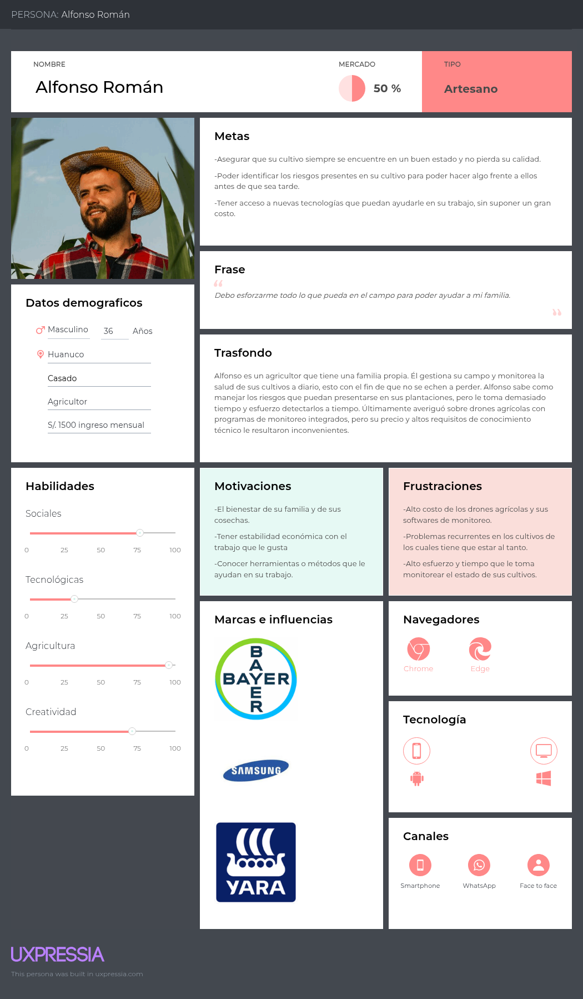

**User Persona 2 - Segmento: Ingenieros agrónomos**

Ignacio representa al profesional que asesora a productores y necesita información para evaluar cultivos y fundamentar sus decisiones. G1, G2 y G3 respaldan ese contexto. La dificultad para supervisar extensiones de cultivo orienta a organizar la información por parcela; la resistencia de algunos clientes a cambiar prácticas es un hallazgo específico de G3.

| Necesidad representada o aporte para el arquetipo | Sustento en entrevistas | Implicación propuesta para el diseño |
| :--- | :--- | :--- |
| Reunir información útil para evaluar el estado de los cultivos. | G1, G2 y G3 solicitan imágenes o mapas para apoyar la evaluación; G3 describe observaciones y mediciones de campo. | Mostrar el contexto de la parcela y los hallazgos disponibles, diferenciando observaciones, mediciones y resultados del procesamiento de imágenes. |
| Comparar información entre ciclos y coordinar el seguimiento de varios terrenos. | G1 y G2 solicitan historial y gestión colaborativa. | Proponer reportes por parcela y fecha, junto con identificación de los usuarios que participan en su seguimiento. |
| Reducir barreras para incorporar tecnología al trabajo. | G1 y G2 mencionan costos o restricciones tecnológicas; G3 describe resistencia de algunos clientes a nuevas prácticas. | Explicar el propósito y los resultados de cada función, con información comprensible que pueda comunicarse al productor. |
| Consultar y procesar información considerando el contexto de trabajo. | G2 menciona uso de laptop y necesidad de operación sin conexión. | Diseñar vistas legibles en escritorio y estados que indiquen la disponibilidad de información; no se asume que todos los agrónomos usen el mismo equipo. |

Las necesidades de estos arquetipos orientan la organización de contenidos y la evaluación posterior de los flujos. No acreditan por sí solas resultados de ahorro, precisión diagnóstica o adopción, ni sustituyen la definición de permisos por rol en los requisitos del producto.

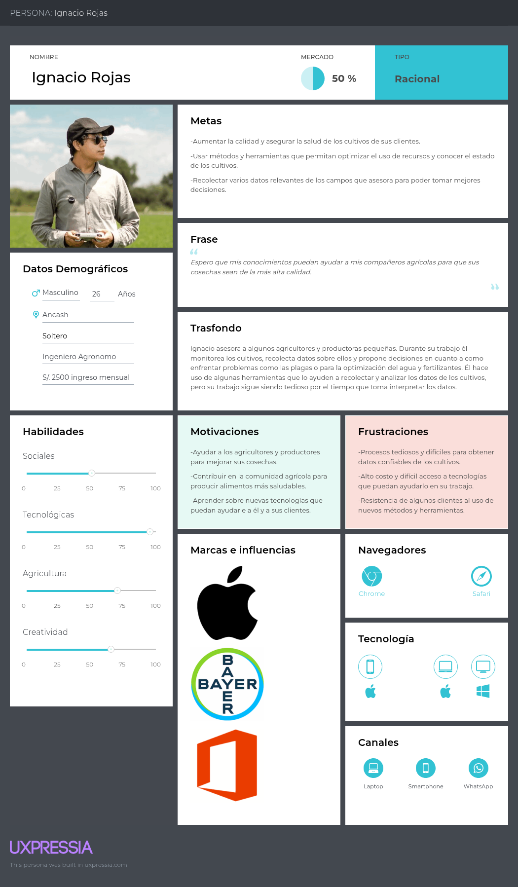

### 2.3.2. User Task Matrix. 

La matriz compara las tareas del trabajo agrícola de Alfonso Román, arquetipo del segmento de agricultores, e Ignacio Rojas, arquetipo del segmento de ingenieros agrónomos. Para cada tarea se distinguen dos dimensiones: la frecuencia con la que se realiza y su importancia para los objetivos del arquetipo. Las tareas describen actividades del dominio que existen independientemente de SkyCrop.

Las categorías **Alta, Media y Baja** se presentan como valoraciones cualitativas de la propuesta de diseño, pendientes de validación. Los resúmenes disponibles no incluyen una medición uniforme de periodicidad ni una escala de importancia aplicada a todos los participantes; por ello, estos valores no se interpretan como frecuencias estadísticas ni como calificaciones expresadas directamente por los entrevistados.

El [análisis de entrevistas](#223-análisis-de-entrevistas) aporta sustento para identificar las actividades: A1 y A2 describen la supervisión de cultivos y las dificultades para detectar problemas; G1 y G2 señalan necesidades de evaluación, seguimiento histórico y gestión de varios terrenos; G3 detalla observación de plantas, evaluación de humedad y nutrientes y monitoreo de plagas. Esa evidencia respalda la selección de tareas, pero no determina por sí sola el nivel asignado a cada celda.

<table border="1">
  <tr>
    <th rowspan="2">Tareas</th>
    <th colspan="2">Alfonso Román</th>
    <th colspan="2">Ignacio Rojas</th>
  </tr>

  <tr>
    <th>Frecuencia</th>
    <th>Importancia</th>
    <th>Frecuencia</th>
    <th>Importancia</th>
  </tr>

  <tr>
    <td>Monitoreo general del campo</td>
    <td>Alta</td><td>Media</td>
    <td>Media</td><td>Media</td>
  </tr>

  <tr>
    <td>Mantenimiento de los cultivos</td>
    <td>Alta</td><td>Alta</td>
    <td>Baja</td><td>Media</td>
  </tr>

  <tr>
    <td>Evaluación de la humedad del suelo</td>
    <td>Media</td><td>Media</td>
    <td>Alta</td><td>Media</td>
  </tr>

  <tr>
    <td>Revisión del crecimiento de los cultivos</td>
    <td>Alta</td><td>Media</td>
    <td>Alta</td><td>Media</td>
  </tr>

  <tr>
    <td>Monitoreo de la presencia de plagas</td>
    <td>Alta</td><td>Alta</td>
    <td>Alta</td><td>Alta</td>
  </tr>

  <tr>
    <td>Identificación de problemas en los cultivos</td>
    <td>Baja</td><td>Alta</td>
    <td>Media</td><td>Alta</td>
  </tr>

  <tr>
    <td>Registro de información del estado de los cultivos</td>
    <td>Baja</td><td>Baja</td>
    <td>Alta</td><td>Media</td>
  </tr>

  <tr>
    <td>Planificación del uso de insumos</td>
    <td>Media</td><td>Alta</td>
    <td>Alta</td><td>Alta</td>
  </tr>

  <tr>
    <td>Análisis del cultivo y toma de decisiones</td>
    <td>Media</td><td>Media</td>
    <td>Alta</td><td>Alta</td>
  </tr>

  <tr>
    <td>Uso de tecnología para el monitoreo</td>
    <td>Baja</td><td>Media</td>
    <td>Media</td><td>Media</td>
  </tr>
</table>

**Tareas con más frecuencia**  
Para Alfonso, la matriz asigna frecuencia alta al monitoreo general del campo, mantenimiento de los cultivos, revisión de su crecimiento y monitoreo de plagas. Para Ignacio, la frecuencia alta corresponde a la evaluación de humedad del suelo, revisión del crecimiento, monitoreo de plagas, registro de información, planificación de insumos y análisis del cultivo para la toma de decisiones. La revisión del crecimiento y el monitoreo de plagas son las tareas que ambos comparten con frecuencia alta.

**Tareas con más importancia**  
Ambos arquetipos tienen importancia alta en el monitoreo de plagas, la identificación de problemas y la planificación del uso de insumos. Además, el mantenimiento de los cultivos tiene importancia alta para Alfonso y media para Ignacio, mientras que el análisis del cultivo y la toma de decisiones tienen importancia alta para Ignacio y media para Alfonso. La importancia debe leerse separadamente de la frecuencia: por ejemplo, identificar problemas tiene importancia alta para ambos, aunque su frecuencia está clasificada como baja para Alfonso y media para Ignacio.

**Principales diferencias**  
La propuesta distingue el seguimiento operativo de Alfonso del trabajo de evaluación y asesoría de Ignacio. Alfonso presenta mayor frecuencia en el monitoreo general del campo y el mantenimiento de los cultivos. Ignacio presenta mayor frecuencia en evaluación de humedad, identificación de problemas, registro de información, planificación de insumos, análisis para tomar decisiones y uso de tecnología. En importancia, las diferencias se concentran en mantenimiento, registro de información y análisis del cultivo: el primero tiene mayor valoración para Alfonso; los dos últimos, para Ignacio. Estas diferencias describen la matriz propuesta y deben contrastarse con los participantes antes de generalizarse a los segmentos.

**Coincidencias encontradas**  
El monitoreo de plagas es la única tarea con frecuencia e importancia altas para ambos arquetipos. La revisión del crecimiento también tiene frecuencia alta en ambos, pero su importancia es media. Coinciden asimismo en la importancia alta de identificar problemas y planificar insumos, aunque con frecuencias diferentes. El monitoreo general, la evaluación de humedad y el uso de tecnología tienen importancia media para ambos. Por tanto, la matriz no asigna importancia alta a todas las actividades de monitoreo y permite distinguir las prioridades propuestas de cada arquetipo.

### 2.3.3. User Journey Mapping. 

Los siguientes mapas As-Is representan las actividades de Alfonso e Ignacio al revisar y atender sus cultivos o los de sus clientes. Se relacionan con las necesidades descritas en el [análisis de entrevistas](#223-análisis-de-entrevistas) y permiten reconocer dificultades durante el monitoreo y el seguimiento.

**User Journey Map 1 - Alfonso - Segmento: Agricultores**

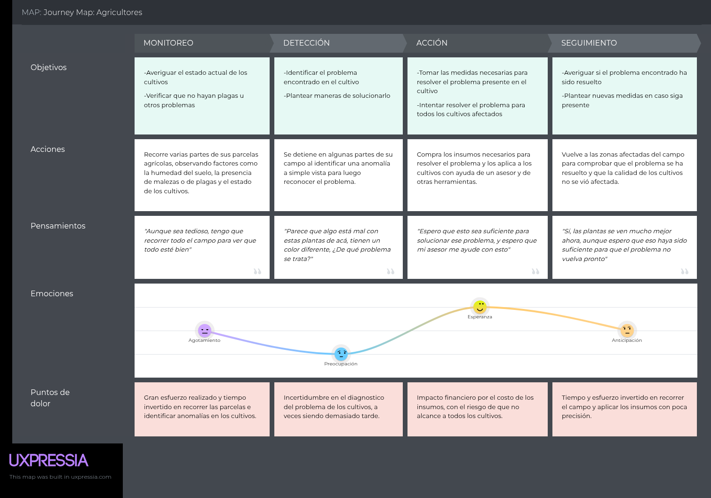

El recorrido de Alfonso comprende monitoreo, detección, acción y seguimiento. La principal dificultad es el tiempo y esfuerzo que requiere recorrer el terreno, una situación mencionada por Drago, Masaru e Higidio. Drago y Masaru también señalan la necesidad de identificar problemas a tiempo y consultar información sencilla sobre sus cultivos. Para SkyCrop, estos hallazgos orientan la presentación del estado de cada parcela y de las zonas que requieren atención. El interés de Masaru en alertas e historial también respalda la propuesta de consultar cómo cambia el cultivo entre revisiones.

**User Journey Map 2 - Ignacio - Segmento: Ingenieros agrónomos**

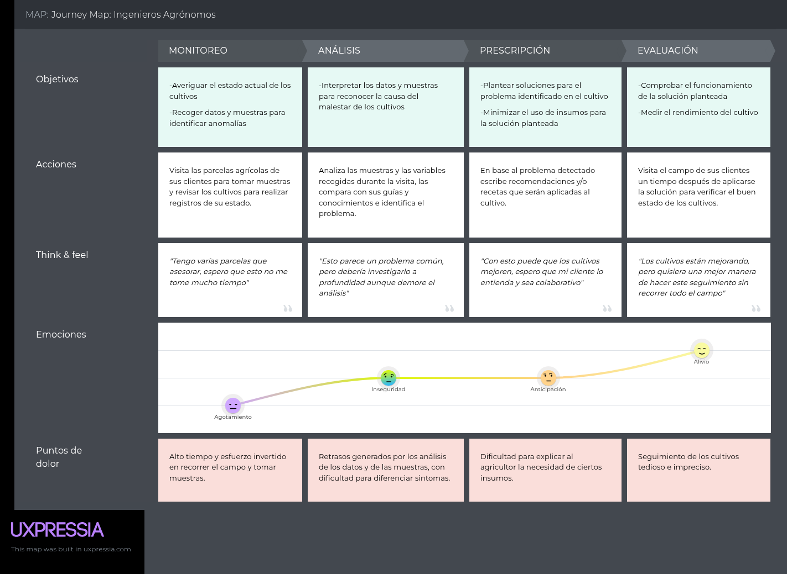

El recorrido de Ignacio comprende monitoreo, análisis, prescripción y evaluación. El mapa destaca el trabajo de recoger información, interpretarla y explicar recomendaciones al agricultor. Las entrevistas de Yamil, Ana y Suzy describen dificultades por el tiempo de supervisión; Suzy añade la toma de muestras y la resistencia de algunos clientes a cambiar sus prácticas. Por su parte, Yamil y Ana solicitan información histórica para comparar cultivos. Esto orienta la propuesta de organizar reportes por parcela y fecha, facilitando la evaluación y el seguimiento profesional.

Los mapas son una síntesis de los arquetipos. Sus pensamientos y emociones son interpretaciones del escenario, no citas textuales ni resultados medidos. El orden exacto de las actividades y los detalles de las intervenciones representadas todavía deben contrastarse con usuarios.

### 2.3.4. Empathy Mapping. 

Los mapas de empatía organizan las necesidades y el contexto de Alfonso e Ignacio en lo que ven, escuchan, dicen, hacen, piensan y sienten. Las dificultades se agrupan como *Pains* y los beneficios que buscan como *Gains*. Para explicar estos puntos, se relaciona el contenido de los mapas con los resúmenes del [análisis de entrevistas](#223-análisis-de-entrevistas). Las frases y emociones atribuidas a los arquetipos son interpretaciones que aún requieren validación.

**Empathy Map 1 - Alfonso - Segmento: Agricultores**

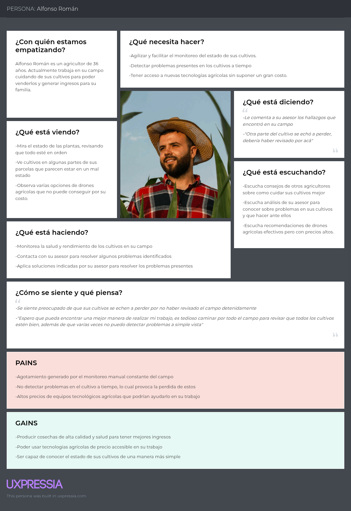

En Alfonso destacan el esfuerzo del monitoreo manual y la dificultad de detectar problemas a tiempo. Drago, Masaru e Higidio describen limitaciones de tiempo para supervisar sus terrenos; Drago también menciona barreras de costo y conocimientos para aprovechar la tecnología. Estos puntos se relacionan con el interés del mapa en acceder a herramientas asequibles y conocer el estado del cultivo de forma sencilla. La mejora de ingresos que aparece entre sus *Gains* representa una expectativa, no un resultado comprobado.

**Empathy Map 2 - Ignacio - Segmento: Ingenieros Agrónomos**

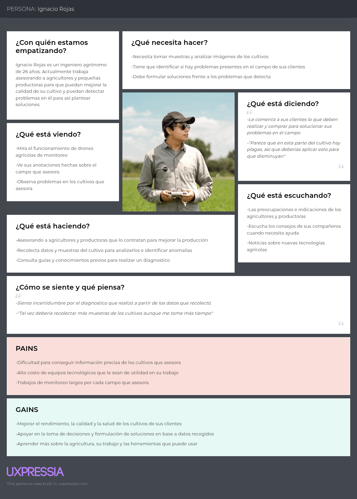

En Ignacio destacan el tiempo dedicado a supervisar parcelas y la necesidad de información útil para evaluar cultivos. Yamil, Ana y Suzy mencionan estas dificultades, mientras que Yamil y Ana señalan costos y restricciones de las herramientas disponibles. La toma de muestras descrita por Suzy se relaciona con las actividades del mapa. Sus *Gains* apuntan a apoyar las decisiones y mejorar el seguimiento de los cultivos; para SkyCrop, esto orienta la consulta de reportes e información histórica como apoyo al trabajo del agrónomo.

## 2.4. Big Picture EventStorming. 

En esta sección se presenta el tablero del Big Picture EventStorming elaborado por el equipo GreenTech, el cual servirá como una vista general del dominio del negocio. Se presentarán los pasos seguidos para su elaboración.

**1- Colocación de eventos del dominio**  
En esta primera fase los integrantes del equipo colocaron eventos que se relacionen al dominio del negocio, denotados por tarjetas naranjas.

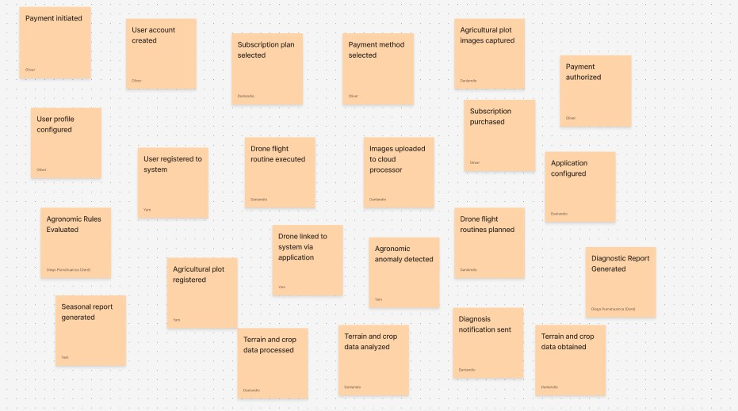

**2- Ordenamiento de los eventos**  
En esta fase los integrantes del equipo ordenaron los eventos hasta formar una secuencia cronológica.

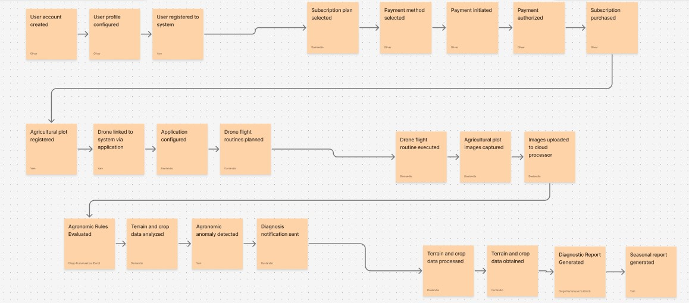

**3- Colocación de actores y sistemas externos**  
En esta fase los integrantes del grupo agregaron a los eventos unas tarjetas de color amarillo que representan a los actores de algunas series de eventos y otras tarjetas azules que representan a los sistemas externos involucrados.

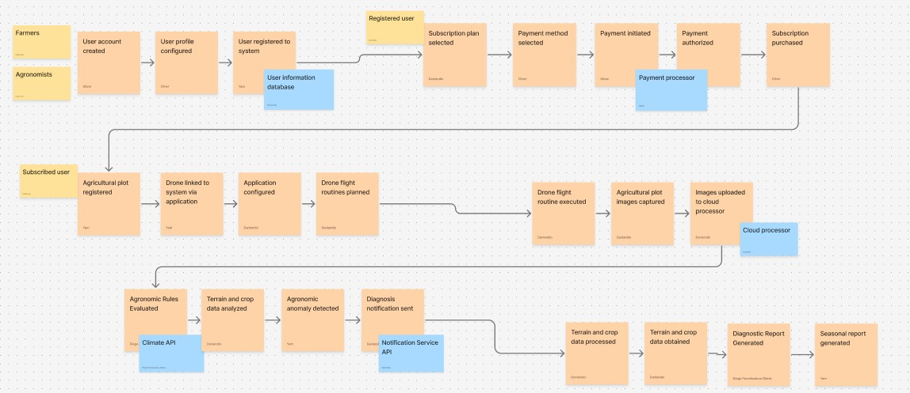

**4- Identificación de problemas en la secuencia**  
En esta última fase los integrantes identificaron problemas que podrían ocurrir durante la secuencia de eventos y representaron tales problemas mediante tarjetas rosadas.

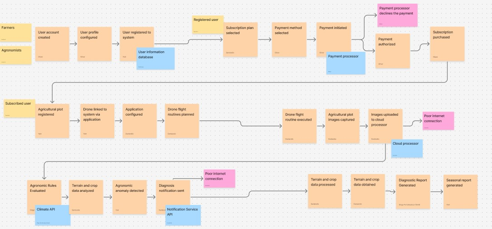

A partir de este proceso, identificamos lo siguiente:

**Procesos clave:**

- Creación de cuenta y perfil de los usuarios de la plataforma
- Selección de subscripción y pago
- Configuración y planificación del vuelo de los drones
- Recolección y envío de datos
- Procesamiento y presentación de datos
- Envío de notificaciones a partir de lo procesado

**Problemas:**

- La mala conexión a internet puede afectar a varios usuarios con mala conectividad, dificultando la recepción de notificaciones importantes.
- Puede haber dependencia en la calidad de las imágenes capturadas por el dron para el análisis de los cultivos.
- Los drones pueden verse limitados por su batería o alcance, lo cual pone en riesgo la recolección y envío de imágenes capturadas.

**Oportunidades:**

- La automatización de vuelos de drones para la recolección de información.
- La generación de notificaciones y reportes puede resultar convenientes para los agricultores.
- Contar con un sistema de perfiles puede facilitar el traslado de la configuración de un dron a otro.

## 2.5. Ubiquitous Language. 

|Término    |Definición             |
|:----------|:----------------------|
|User (Usuario)                       |Persona en general que haga uso de la plataforma SkyCrop y de sus servicios|
|Farmer (Agricultor)                  |Persona perteneciente al segmento de agricultores que haya creado una cuenta de agricultor en la plataforma SkyCrop|
|Agronomist (Agrónomo)                |Persona perteneciente al segmento de ingenieros agrónomos que haya creado una cuenta de agrónomo en la plataforma SkyCrop|
|Subscription (Subscripción)          |Licencia de uso de la aplicación y servicios de la plataforma SkyCrop|
|Agricultural Plot (Parcela Agrícola) |Zona registrada en la plataforma SkyCrop y monitoreada por cuentas de agricultores y agrónomos con los permisos suficientes|
|Drone (Dron)                         |Equipo registrado en la plataforma SkyCrop y gestionado por cuentas de agricultores y agrónomos con los permisos suficientes|
|Crop (Cultivo) |Tipo o variedad de planta registrada en una parcela para su monitoreo.|
|Monitoring (Monitoreo) |Seguimiento del estado de los cultivos mediante observaciones, imágenes y datos de la parcela.|
|Flight Route (Ruta de vuelo) |Recorrido planificado que sigue un dron para capturar imágenes de una parcela.|
|Anomaly (Anomalía) |Señal de un posible problema en el cultivo que requiere evaluación para determinar su causa.|
|Diagnosis (Diagnóstico) |Resultado del análisis de la información de una parcela que describe su estado y los problemas identificados.|
|Report (Reporte) |Documento que reúne resultados del monitoreo de una parcela para su consulta, seguimiento o comparación.|
|Alert (Alerta) |Aviso que comunica una condición que requiere atención, como una anomalía en el cultivo o un fallo del dron.|

# Capítulo III: Requirements Specification 

## 3.1. User Stories

A continuación se presentan las User Stories que indicarán las funcionalidades que nuestro producto deberá cumplir.

|Epic / Story ID|Título|Descripción|Criterios de aceptación|Relacionado con|
|:--------------|:-----|:----------|:----------------------|:--------------|
| **EP-01** | Gestión de cuentas y autentificación|Como usuario de la plataforma SkyCrop, quiero registrar una cuenta, iniciar sesión en ella, mantener mi perfil actualizado y cerrar sesión, para acceder de manera segura a la plataforma.|- Registro con validación de correo y contraseña.   - Actualización de información del perfil.   - Cierre de sesión seguro.|-----|
| US-01 | Registrar la cuenta de un Usuario| Como usuario de la plataforma SkyCrop, deseo registrarme en la plataforma para poder acceder a las funcionalidades que ofrece|**Scenario: Registro exitoso de un usuario**  *Given* el usuario está en el formulario de registro  *When* ingresa su nombre, correo y contraseña (≥ 8 caracteres) *And* acepta los términos   *Then* el sistema guarda la información *And* envía una confirmación por correo | EP-01|
| US-02 | Inicio de Sesión |  Como usuario registrado en la plataforma SkyCrop, deseo iniciar sesión a la plataforma usando mis credenciales para volver a tener acceso a mi cuenta  | **Scenario: Inicio de Sesión exitoso**   *Given* El usuario ha ingresado los datos correctos   *When* Presiona el botón de iniciar sesión   *Then* El usuario ingresa a su cuenta dentro de la plataforma.   **Scenario: El usuario ingresa datos erróneos**  *Given* El usuario ingresa datos erróneos   *When* Presiona el botón de iniciar sesión   *Then* La página mostrará el mensaje de "Usuario o contraseña incorrecto" | EP-01|
| US-03 | Cambiar la información del perfil | Como usuario registrado en la plataforma SkyCrop, deseo ser capaz de cambiar la información de mi perfil para corregir datos incorrectos o desactualizados | **Scenario: Perfil actualizado**   *Given* el usuario accede a su perfil   *When* edita su información *And* guarda los cambios *Then* el sistema actualiza los datos de su cuenta| EP-01 |
| US-04 | Recuperación de acceso| Como usuario registrado en la plataforma SkyCrop, deseo tener opciones para recuperar el acceso a mi cuenta para no perder el acceso a mi información en caso olvide mi contraseña| **Scenario: Recuperación de acceso a una cuenta**   *Given* El usuario se encuentra en la pagina de inicio de sesión.   *When* Selecciona la opción de 'Recuperar acceso'. *And* Ingresa su correo electrónico.   *Then* El sistema envía un código de recuperación al correo ingresado.| EP-01 |
| US-05 | Autenticación de dos factores | Como usuario registrado en la plataforma SkyCrop, quiero tener la capacidad de activar la autenticación de dos factores en mi cuenta para tener una segunda capa de seguridad.| **Scenario: Autenticación de dos factores**   *Given* El usuario ha activado la autenticación de dos factores en su cuenta *And* Se encuentra en la página de inicio de sesión.   *When* Ingresa sus credenciales *And* Presiona el botón de iniciar sesión. *Then* El sistema evalúa las credenciales *And* Envía un código de uso único al correo del usuario.| EP-01 |
| **EP-02** | Pago de subscripción|Como usuario de la plataforma SkyCrop, requiero de un sistema de pagos que me permita ingresar mis datos bancarios de manera segura, para pagar mi suscripción de la plataforma|- Pago por medio de diversos procesadores de pago. - Verificación del estado del pago.|-----|
| US-06 | Adquisición de subscripciones | Como usuario registrado en la plataforma SkyCrop, deseo adquirir una subscripción en la plataforma para tener acceso a las funcionalidades pagadas que ofrece| **Scenario: Adquirir una subscripción**   *Given* El usuario ha elegido una subscripción.   *When* Ingresa los datos necesarios para realizar el pago *And* La transacción es aprobada.   *Then* El sistema asigna la subscripción a la cuenta del usuario *And* Permite que se acceda a las funcionalidades de pago.| EP-02 |
| US-07 | Pagar la suscripción con tarjeta | Como usuario registrado en la plataforma SkyCrop, deseo pagar mi suscripción con tarjeta, para renovar mi subscripción de manera rápida y segura| **Scenario: Pago exitoso**   *Given* El usuario ha ingresado sus datos bancarios   *When* El usuario presiona el botón de realizar pago *And* El procesador de pagos aprueba el pago.   *Then* La página mostrará el mensaje "El pago fue exitoso"   **Scenario: Se ingresan datos bancarios no válidos**   *Given* El usuario ha ingresado datos bancarios no válidos   *When* El usuario presiona el botón de realizar pago *And* el procesador de pago rechaza el pago.   *Then* La página mostrará el mensaje "Error al realizar el pago" *And* Brindará más detalles del error. | EP-02 |
| US-08 | Confirmación de pagos| Como usuario registrado en la plataforma SkyCrop, quiero recibir una confirmación del pago de una subscripción para tener un registro de las transacciones realizadas. | **Scenario: Recepción de comprobación tras pago**   *Given* El usuario ha realizado un pago de una subscripción.   *When* El sistema verífica la realización pago.   *Then* Envía un comprobante del pago al correo del usuario. | EP-02 |
| US-09 | Consulta de detalles de la subscripción actual | Como usuario suscrito en la plataforma SkyCrop, quiero consultar los detalles de mi subscripción actual para conocer hasta cuando es vigente y a que funciones tengo acceso| **Scenario: Consulta de subscripción activa**   *Given* El usuario cuenta con una subscripción vigente *And* Se encuentra en su perfil.   *When* El usuario ingresa a la sección de subscripciones.   *Then* El sistema muestra el tipo de subscripción vigente *And* Muestra detalles como la fecha de vigencia y funcionalidades disponibles.| EP-02|
| US-10 | Cancelación de subscripciones| Como usuario suscrito en la plataforma SkyCrop, quiero ser capaz de cancelar mi subscripción en la plataforma para evitar gastos accidentales.|**Scenario: Cancelación de subscripción vigente**   *Given* El usuario se encuentra en la sección de subscripciones en su perfil.   *When* Solicita la cancelación de una subscripción.   *Then* El sistema marca a la subscripción como cancelada *And* Revoca al usuario los permisos asociados a tal subscripción| EP-02|
| **EP-03** | Gestión de parcelas agrícolas|Como usuario de la plataforma SkyCrop, deseo un sistema de registro y gestión que me permita registrar mis parcelas agrícolas para poder gestionarlas y monitorearlas.|- Registro de un terreno. - Revisión del estado del terreno y sus cultivos.|-----|
| US-11 | Registro de parcela | Como usuario, deseo registrar el terreno por el cual el dron va a volar | **Scenario: Registrar el tamaño del terreno**   *Given* El usuario registra la dimensiones del terreno en una pestaña   *When* el usuario presiona el botón de "registrar terreno"   *Then* La página mostrará el mensaje "Terreno Registrado" | EP-03 |
| US-12 | Consulta de estado de una parcela| Como usuario de la plataforma SkyCrop, deseo consultar el estado de una parcela para conocer los niveles de salud e hidratación del suelo detectados por el dron. | **Scenario: Consulta de estado de parcela exitoso**    *Given* el usuario tiene parcelas registradas   *When* selecciona una parcela específica de la lista   *Then* el sistema despliega el panel de telemetría con los datos de humedad, temperatura y salud del suelo.| EP-03 |
| US-13 | Visualización del mapa de una parcela| Como usuario de la plataforma SkyCrop, quiero visualizar el mapa de mi parcela para identificar zonas de anomalías visualmente. | **Scenario: Visualizar mapa de calor**   *Given* el usuario se encuentra en el detalle de la parcela   *When* activa la pestaña de 'Mapa'   *Then* el sistema renderiza el mapa satelital con zonas rojas para indicar las zonas de riesgo. | EP-03 |
| US-14 | Registro de cultivos en una parcela| Como usuario de la plataforma SkyCrop, quiero registrar el tipo de cultivo de mi parcela para que el sistema adapte las alertas a las necesidades específicas de mi planta. | **Scenario: Asignación de cultivo a parcela**   *Given* el usuario edita los detalles de una parcela   *When* selecciona una variedad de cultivo de la lista *And* guarda los cambios   *Then* la plataforma confirma que el cultivo fue enlazado exitosamente. | EP-03 |
| US-15 | Consulta de información de los cultivos| Como usuario de la plataforma SkyCrop, deseo acceder a la ficha técnica de mis cultivos asignados para entender el ciclo de crecimiento y alertas sugeridas. | **Scenario: Ver detalles técnicos del cultivo**   *Given* el usuario visualiza el estado de una parcela   *When* selecciona el nombre del cultivo activo   *Then* el sistema despliega información agronómica relevante y los umbrales ideales de humedad. | EP-03 |
| US-16 | Invitación de compañeros| Como administrador de una cuenta de SkyCrop, quiero invitar a compañeros de trabajo o agrónomos a mis parcelas para compartir el monitoreo de los campos. | **Scenario: Enviar invitación por correo**   *Given* el usuario está en el panel de configuración de la parcela   *When* ingresa el correo de su compañero And presiona 'Enviar invitación'   *Then* el sistema despacha un enlace de acceso al invitado And muestra el estado de la invitación como 'Pendiente'.| EP-03|
| **EP-04** | Gestión de drones|Como usuario de la plataforma SkyCrop, quiero un sistema de registro y configuración de drones conectar mi dron y configurar una rutina de vuelo.|-Conexión del dron. - Gestión de la rutina de vuelo.||
| US-17 | Conectar el dron | Como usuario, deseo conectar el aplicativo con mi dron | **Scenario 1: La conexion es exitosa**   *Given* El usuario presiona el botón "Conectar Dron"   *When* El dron funciona adecuadamente y esta suficientemente cerca del dispositivo con el aplicativo   *Then* Se mostrara el mensaje "Conexión exitosa"   **Scenario 2: La conexión es no exitosa**   *Given* El usuario presiona el botón "Conectar Dron"   *When* El dron no funciona adecuadamente y/o está lejos del dispositivo con el aplicativo   *Then* Se mostrará el mensaje "Conexión fallida" | EP-04 |
| US-18 | Gestionar la rutina de vuelo | Como usuario, deseo gestionar la rutina de vuelo que el dron va a patrullar | **Scenario 1: Se ingresa la rutina dentro de los parámetros permitidos**   *Given* el usuario ingresa la rutina de vuelo   *When* la rutina de vuelo se encuentra dentro de los parámetros   *Then* Se mostrará el mensaje "Rutina registrada exitosamente".   **Scenario 2: La rutina no se encuentra dentro de los parámetros permitidos**   *Given* el usuario ingresa la rutina de vuelo   *When* la rutina de vuelo no se encuentra dentro de los parámetros   *Then* Se mostrará el mensaje "Rutina debe encontrarse en los parámetros permitidos".   | EP-04 |
| US-19 | Captura de imágenes mediante dron | Como usuario de la plataforma SkyCrop, quiero que el dron capture imágenes automáticamente durante su rutina para recolectar datos visuales de la parcela. | **Scenario 1: Captura automática de imágenes**   *Given* el dron se encuentra ejecutando una rutina de vuelo activa   *When* alcanza un punto de control (waypoint) programado   *Then* la cámara del dron captura una imagen de alta resolución.| EP-04 |
| US-20 | Parametrización de vuelo del dron | Como usuario de la plataforma SkyCrop, quiero configurar los parámetros técnicos de vuelo para optimizar la toma de capturas. | **Scenario 1: Guardar parámetros válidos**    *Given* el usuario se encuentra en el panel de parametrización   *When* ingresa valores de altura y velocidad permitidos And presiona "Guardar"   *Then* el sistema actualiza la configuración del dron.   **Scenario 2: Parámetros fuera de rango**   *Given* el usuario ingresa una altura que excede el límite legal o técnico   *When* intenta guardar la configuración   *Then* el sistema muestra la alerta "Valor fuera de rango permitido". | EP-04 |
| US-21 | Envío de imágenes tomadas por el dron | Como usuario de la plataforma SkyCrop, deseo que el dron envíe las imágenes capturadas al servidor para que puedan ser procesadas por el sistema. | **Scenario 1: Envío exitoso con buena señal**   *Given* el dron ha finalizado la captura de imágenes   *When* detecta una conexión a internet o enlace estable   *Then* transfiere las imágenes al servidor *And* muestra el progreso en el aplicativo.   **Scenario 2: Pérdida de conexión durante el envío**   *Given* el dron está enviando las imágenes   *When* la conexión se interrumpe   *Then* el sistema pausa la transferencia *And* la reanuda automáticamente al recuperar la señal. | EP-04 |
| US-22 | Visualización de imágenes tomadas por el dron | Como usuario de la plataforma SkyCrop, quiero visualizar la galería de imágenes tomadas por el dron para verificar la calidad del patrullaje antes del procesamiento. | **Scenario 1: Visualización correcta de galería**   *Given* las imágenes del vuelo ya se han sincronizado   *When* el usuario ingresa al historial de vuelos y selecciona la galería   *Then* el sistema despliega el carrete de imágenes ordenadas cronológicamente y por geolocalización. | EP-04 |
| **EP-05** | Diagnósticos |Como usuario, deseo que el sistema realice un diagnóstico de la información que recolecto y envíe una notificación de los puntos más importantes.|- Creación de un diagnóstico. - Manejo de dignósticos|-----|
| US-23 | Generación de diagnóstico | Como usuario, deseo que se cree un diagnóstico y se guarde como un registro cuando culmine la rutina del dron | **Escenario: Se crea un diagnóstico**   *Given* Que se crea un diagnóstico   *When* Acaba la rutina del dron   *Then* Se guarda como un registro aparte | EP-05 |
| US-24 | Generación de mapa según diagnóstico | Como usuario con acceso a una parcela, deseo contar con un mapa de los resultados del diagnóstico para ubicar las zonas que requieren atención. | **Scenario: Mapa generado**   *Given* que un diagnóstico finalizado contiene resultados con ubicación en la parcela   *When* el sistema genera el mapa del diagnóstico   *Then* representa las zonas analizadas y sus resultados con una leyenda.   **Scenario: Ubicación insuficiente**   *Given* que el diagnóstico no contiene información suficiente para ubicar los resultados   *When* el sistema intenta generar el mapa   *Then* informa que el mapa no está disponible y conserva el diagnóstico para su consulta. | EP-05 |
| US-25 | Historial de diagnósticos | Como usuario con acceso a una parcela, deseo consultar sus diagnósticos anteriores para revisar la evolución del cultivo. | **Scenario: Consulta del historial**   *Given* que el usuario tiene acceso a una parcela con diagnósticos registrados   *When* consulta su historial   *Then* obtiene los diagnósticos ordenados del más reciente al más antiguo y puede consultar la fecha y los resultados de cada uno.   **Scenario: Historial vacío**   *Given* que el usuario tiene acceso a una parcela sin diagnósticos registrados   *When* consulta su historial   *Then* el sistema informa que todavía no existen diagnósticos.   **Scenario: Acceso no permitido**   *Given* que el usuario no tiene acceso a una parcela   *When* intenta consultar sus diagnósticos   *Then* el sistema rechaza la consulta sin mostrar sus resultados. | EP-05 |
| US-26 | Actualización de una parcela mediante diagnóstico | Como usuario con acceso a una parcela, deseo que su estado refleje el diagnóstico más reciente para consultar información actualizada del cultivo. | **Scenario: Actualización del estado**   *Given* que finaliza un diagnóstico de una parcela con datos de monitoreo más recientes que los del estado actual   *When* el sistema registra sus resultados   *Then* actualiza el estado de la parcela con esos resultados y la fecha del monitoreo, conservando los diagnósticos anteriores en el historial.   **Scenario: Resultado de un monitoreo anterior**   *Given* que finaliza un diagnóstico cuyos datos de monitoreo son anteriores a los del estado actual   *When* el sistema registra sus resultados   *Then* lo incorpora al historial sin reemplazar el estado más reciente de la parcela. | EP-05 |
| **EP-06** | Notificaciones | Como usuario, quiero que el sistema me envíe notificaciones cuando ocurran eventos importantes para enterarme a tiempo sobre lo ocurrido |- Notificación de resultados obtenidos. - Notificación especial en el caso de una anomalía.|-----|
| US-27 | Notificación de diagnóstico realizado | Como usuario, deseo que me notifiquen a mi dispositivo cuando culmine el diagnóstico del terreno | **Scenario: Se envía el diagnóstico**   *Given* Que el dron termina su rutina de vuelo   *When* Acaba de realizar su diagnóstico   *Then* Se envia un mensaje al dispositivo del usuario. | EP-06 |
| US-28 | Notificación de anomalía detectada | Como usuario, deseo que se me envíe una notificación especial en el caso de que se detecte una anomalía | **Scenario: Se envía la notificación de emergencia**   *Given* Que se detecte una anomalía   *When* Se realiza el diagnóstico   *Then* Se envía una notificación acerca de la anomalía | EP-06 |
| US-29 | Notificación de fallo del dron| Como usuario de la plataforma SkyCrop, deseo recibir una alerta inmediata si el dron sufre alguna falla | **Scenario: Notificación de error crítico**   *Given* el dron se encuentra ejecutando una ruta aérea   *When* el hardware detecta una falla   *Then* el sistema envía una notificación push de alta prioridad al dispositivo | EP-06 |
| US-30 | Recordatorio de renovación de subscripción| Como usuario registrado, quiero recibir un aviso días antes del vencimiento de mi suscripción | **Scenario: Envío de recordatorio de pago**   *Given* la suscripción del usuario expira en 5 días o menos   *When* el sistema verifica los estados de cuenta diariamente   *Then* se despacha una notificación al dispositivo y un correo electrónico con el enlace directo de renovación. | EP-06 |
| **EP-07** | Generación de reportes |Como usuario, necesito recibir un reporte de todos los diagnósticos realizados y un informe estacional, todo esto disponible para descargar cómo un archivo PDF.|- Creación de un reporte de cada diagnóstico. - Creación de un reporte de cada diagnóstico según la estación del año.  - Botón para descargar cada diagnóstico y reporte como un PDF.|-----|
| US-31 | Creación de reporte según la estación | Como usuario, deseo que se cree un reporte estacional utilizando los diversos reportes generados | **Scenario: Se crea un reporte estacional**   *Given* Que se generen suficientes reportes en durante una estación (mínimo 5)   *When* El calendario estacional indique que se esta a mitad de una estación   *Then* Se crea el reporte estacional | EP-07 |
| US-32 | Compartir | Como usuario de la plataforma SkyCrop, deseo compartir los reportes generados mediante un enlace o correo electrónico para comunicarme con entidades externas. | **Scenario: Compartir reporte exitosamente**   *Given* el usuario visualiza un reporte o informe estacional   *When* presiona el botón "Compartir" e ingresa el correo del destinatario   *Then* el sistema envía un enlace de acceso seguro para visualizar el documento. | EP-07 |
| US-33 | Guardado de reportes en la nube| Como usuario de SkyCrop, quiero que los reportes se almacenen automáticamente en la nube para acceder al histórico de diagnósticos en cualquier momento sin perder información. | **Scenario: Almacenamiento automático en la nube**   *Given* que el sistema finaliza la consolidación de un reporte   *When* se genera el archivo definitivo   *Then* el sistema lo aloja en el almacenamiento en la nube del usuario. | EP-07 |
| US-34 | Comparación entre reportes| Como usuario de la plataforma SkyCrop, deseo seleccionar dos reportes distintos para comparar los valores entre ambos. | **Scenario: Comparación gráfica de evolución**   *Given* el usuario se encuentra en el historial de reportes   *When* selecciona dos reportes distintos *And* presiona "Comparar"   *Then* la plataforma genera una vista dividida mostrando los dos reportes uno al lado del otro. | EP-07 |
| US-35 | Guardado de reportes como PDF | Como usuario, deseo descargar cada uno de los reportes cómo un archivo PDF. | **Scenario: Se descarga un reporte**   *Given* Que se tenga un reporte ya generado   *When* El usuario presione el botón de "descargar" al lado del reporte   *Then* Se descarga automáticamente ese reporte como un PDF en el dispositivo del usuario. | EP-07 |
| **EP-08** | Landing Page | Como visitante, quiero conocer lo que la plataforma SkyCrop ofrece y los beneficios que puede brindarme para decidir si debería registrarme|- Visualización del proposito de la plataforma. - Visualización de las funcionalidades y beneficios que ofrece. - Visualización de los planes y precios.|-----|
| US-36 | Presentación de SkyCrop | Como visitante de la Landing Page, quiero ver una introducción clara con la propuesta de valor de SkyCrop para entender rápidamente qué hace el software. | **Scenario: Carga de la sección de Presentación**   *Given* que el visitante ingresa a la URL principal   *When* la página termina de cargar   *Then* se muestra el eslogan principal, una breve descripción y el botón para registrarse. | EP-08|
| US-37 | Demostración de funcionalidades de SkyCrop | Como visitante, quiero ver una sección interactiva de características de la plataforma para comprender las herramientas con las que cuenta el aplicativo. | **Scenario: Interacción con características**   *Given* el visitante hace scroll hasta la sección de funcionalidades   *When* visualiza los bloques interactivos de mapeo, telemetría y drones   *Then* puede ver animaciones o capturas de pantalla reales del panel interno. | EP-08 |
| US-38 | Muestra de beneficios para agricultores | Como productor agrícola visitante, quiero identificar de qué forma SkyCrop mejora el rendimiento de mis parcelas para evaluar la rentabilidad de mi inversión. | **Scenario: Visualización de valor para agricultores**   *Given* el visitante está explorando la sección de beneficios   *When* filtra por el perfil 'Agricultor'   *Then* el sistema destaca métricas como el ahorro de agua, prevención de plagas y facilidad de uso. | EP-08 |
| US-39 | Muestra de beneficios para agrónomos | Como ingeniero agrónomo visitante, deseo conocer el tipo de analítica y datos técnicos que recolecta el sistema para ver si se adapta a mis consultorías profesionales. | **Scenario: Visualización de valor para agrónomos**   *Given* el visitante está explorando la sección de beneficios   *When* filtra por el perfil 'Agrónomo'   *Then* la página muestra los gráficos detallados de índices de vegetación, automatización de reportes estacionales y gestión multi-parcela. | EP-08 |
| US-40 | Planes de subscripciones y precios| Como visitante interesado, quiero ver de forma transparente los planes y tarifas disponibles para seleccionar la opción que mejor se ajuste a mis necesidades. |  **Scenario: Comparación de precios**   *Given* el visitante navega a la sección de tarifas   *When* revisa la cuadrícula de planes   *Then* el sistema detalla el costo mensual, características incluidas y un botón para suscribirse. | EP-08 |
| US-41 | Opción de contacto| Como visitante, quiero tener una manera de contactarme con personal de soporte de la plataforma para aclarar mis dudas. | **Scenario: Contacto mediante la plataforma**   *Given* el visitante lee la sección "Contáctanos"     *When* Llena el formulario *And* envía el mensaje   *Then* El sistema envía el mensaje al personal de soporte *And* Se guarda el correo del remitente para enviar una respuesta pronto. | EP-08 |
| US-42 | Navegación rápida por la Landing Page | Como visitante, deseo contar con una barra de navegación fija en la parte superior para saltar directamente a las secciones que me interesan sin perder tiempo. | **Scenario: Uso de la barra de navegación**   *Given* el visitante se encuentra en cualquier parte de la Landing Page   *When* hace clic en un elemento del menú   *Then* la pantalla realiza un desplazamiento suave hasta la sección correspondiente. | EP-08 |
| US-43 | Pie de página informativo | Como visitante, quiero ver un footer con enlaces institucionales, términos de servicio y redes sociales para validar la seriedad de la empresa y poder contactarlos. | **Scenario: Visualización del Footer**   *Given* el visitante llega al final de la página web   *When* revisa el pie de página   *Then* encuentra los accesos a políticas de privacidad, canales de soporte técnico y derechos reservados de SkyCrop. | EP-08 |
| **EP-09** | RESTful API | Como desarrollador, quiero que el proyecto cuente con una RESTful API para permitir la manipulación de datos y el acceso a otras funciones desde otros sistemas|  -Consulta de datos de la plataforma.  - Actualización de datos de la plataforma.  - Procesamiento de datos ingresados. |-----|
| TS-01 |Manejo de datos de usuarios| Como sistema, quiero ver y modificar los datos de los usuarios de forma segura. | **Scenario: Ver datos de un usuario**   *Given* que el sistema pide los datos de un usuario con un código correcto   *When* el servidor valida el acceso   *Then* muestra la información del usuario en pantalla. | EP-09 |
| TS-02 |Manejo de datos de parcelas| Como sistema, quiero registrar y actualizar los datos de los terrenos agrícolas en la plataforma. | **Scenario: Registrar terreno nuevo**   *Given* que el sistema envía los datos de un nuevo terreno   *When* se presiona guardar   *Then* el servidor guarda el terreno con éxito. | EP-09 |
| TS-03 |Manejo de reportes| Como sistema, quiero buscar y descargar los reportes creados para enviarlos a otros programas. | **Scenario: Descargar un informe estacional**   *Given* que el usuario busca un reporte por fecha   *When* el sistema encuentra el archivo   *Then* permite descargarlo de forma directa. | EP-09 |
| TS-04 |Manejo de datos de drones| Como sistema, quiero registrar el estado actual de cada dron. | **Scenario: Actualizar estado del dron**   *Given* que el dron está encendido   *When* envía sus datos de al sistema   *Then* el sistema guarda la información actual. | EP-09 |
| TS-05 |Llamados para procesamientos| Como sistema, quiero dar la orden de analizar las imágenes que el dron acaba de tomar. | **Scenario: Iniciar análisis de fotos**   *Given* que el dron subió las fotos de un vuelo   *When* el sistema recibe la orden de procesar   *Then* inicia el diagnóstico automático del terreno. | EP-09 |
| TS-06 |Gestión de notificaciones| Como sistema, quiero un canal para enviar avisos directo a los teléfonos o correos de los usuarios. | **Scenario: Enviar una notificación cualquiera**   *Given* que sucede algun evento que requiera enviar una notificación   *When* el programa se esta ejecutando   *Then* envía un mensaje inmediato al dispositivo del usuario. | EP-09 |
| TS-07 |Servicio de autenticación| Como sistema, quiero validar los accesos para que solo las personas permitidas entren a la API. | **Scenario: Iniciar sesión en la API**   *Given* que el sistema envía el correo y la clave correctos   *When* se verifica la identidad   *Then* se da acceso libre a las funciones. | EP-09 |

## 3.2. Impact Mapping. 

## 3.3. Product Backlog. 

|# Orden|User Story ID|Título|Descripción|Story Points|
|:--------------|:-----|:----------|:----------------------|:--------------|
||||||

# Capítulo IV: Product Design 

## 4.1. Style Guidelines. 

### 4.1.1. General Style Guidelines. 

### 4.1.2. Web Style Guidelines. 

## 4.2. Information Architecture. 

### 4.2.1. Organization Systems. 

### 4.2.2. Labeling Systems. 

### 4.2.3. SEO Tags and Meta Tags 

### 4.2.4. Searching Systems. 

### 4.2.5. Navigation Systems. 

## 4.3. Landing Page UI Design. 

### 4.3.1. Landing Page Wireframe. 

### 4.3.2. Landing Page Mock-up. 

## 4.4. Web Applications UX/UI Design. 

La propuesta visual de la aplicación web SkyCrop se desarrolla en Figma para los segmentos de agricultores e ingenieros agrónomos. Como primer avance, se crearon fundamentos visuales editables: paleta de colores, variables semánticas, estilos tipográficos Roboto, espaciado, radios y elevaciones. Estos recursos se incorporaron en una página nueva para preservar los diseños existentes del equipo.

El diseño adopta Material Design como referencia, los verdes y azules definidos para SkyCrop, controles amplios y una jerarquía de información orientada al monitoreo de cultivos. Las pantallas previstas cubrirán acceso, parcelas, drones, reportes, diagnósticos y colaboración, con adaptación a escritorio y móvil e inglés predeterminado con soporte para español latinoamericano.

**Estado del avance:** fundamentos creados; componentes reutilizables, pantallas, flujos y prototipos pendientes. La cuota de la integración de Figma impidió completar la revisión visual y exportar las capturas de este primer bloque. No se presenta este avance como un prototipo terminado.

- [Fundamentos visuales en Figma](https://www.figma.com/design/1nlenowk3dSY0qdNiG6hYD/Diseno-UX-UI---SkyCrop?node-id=45-3).
- [Detalle de la entrega incremental y sus verificaciones](resources/design/web-app/README.md).

### 4.4.1. Web Applications Wireframes. 

### 4.4.2. Web Applications Wireflow Diagrams. 

### 4.4.3. Web Applications Mock-ups.

### 4.4.4. Web Applications User Flow Diagrams.

## 4.5. Web Applications Prototyping. 

## 4.6. Domain-Driven Software Architecture. 

### 4.6.1. Design-Level EventStorming. 

### 4.6.2. Software Architecture Context Diagram. 

### 4.6.3. Software Architecture Container Diagrams. 

### 4.6.4. Software Architecture Components Diagrams. 

## 4.7. Software Object-Oriented Design. 

### 4.7.1. Class Diagrams. 

## 4.8. Database Design. 

### 4.8.1. Database Diagrams. 

# Capítulo V: Product Implementation, Validation & Deployment  

## 5.1. Software Configuration Management. 

### 5.1.1. Software Development Environment Configuration. 

**Project Management**

Para la administración del proyecto, se utilizaron varias herramientas para la comunicación, la planificación y el control de versiones.

| Plataforma                   | Descripción                                                                                                                                                                                             | Enlace               |
| :--------------------------: | :------------------------------------------------------------------------------------------------------------------------------------------------------------------------------------------------------ | :------------------- |
| Trello                       | Esta plataforma de gestión de proyectos ofrece el seguimiento detallado del progreso de cada tarea, además de permitir la designación de responsables para cada actividad dentro del equipo de trabajo. | https://trello.com   |
| Herramientas de Comunicación | La comunicación interna del equipo se gestionó a través de Discord y WhatsApp para reuniones y mensajes rápidos, respectivamente.                                                                       | https://discord.com/ |
| GitHub                       | Se creó una organización para centralizar el código fuente y su versionado, lo que permitió un control de versiones eficiente y una gestión ordenada.                                                   | https://github.com   |

**Requirement Management**

En la fase inicial, se emplearon herramientas para la recolección y organización de los requisitos del proyecto, lo que aseguró una base sólida para el desarrollo.

| Plataforma | Descripción                                                                                                                                                                                                     | Enlace                 |
| :--------: | :-------------------------------------------------------------------------------------------------------------------------------------------------------------------------------------------------------------- | :--------------------- |
| UXPressia | Se utilizó para elaborar las User Personas, los Journey Maps y los Empathy Maps incluidos en el capítulo II. | https://uxpressia.com/ |
| Miro       | Esta herramienta se usó para visualizar y desarrollar los escenarios "As-Is" (estado actual) y "To-Be" (estado futuro), lo que ayudó a planificar la evolución del proyecto.                                    | https://miro.com/es/   |

**Product UX/UI Design**

Para el diseño de la experiencia y la interfaz de usuario, se usó una plataforma colaborativa que simplificó el flujo de trabajo.

| Plataforma | Descripción | Enlace |
| :--------: | :------------------------------------------------------------------------------------------------------------------------------------------------------------------------------------------------------------- | :-------------------- |
| Figma | Herramienta de diseño para wireframes, mockups y prototipos. El avance de fundamentos visuales de SkyCrop y los diseños pendientes se documentan en 4.4. | https://www.figma.com |

**Software Development**

El desarrollo se realizó utilizando un conjunto de lenguajes y entornos de programación que garantizan la estructura, el estilo y la interactividad del producto.

| Plataforma          | Descripción                                                                                                                                    | Link                                       |
|---------------------| :--------------------------------------------------------------------------------------------------------------------------------------------- | :----------------------------------------- |
| HTML                | Sirve para definir la estructura y el contenido de una página web.                                                                             | https://www.w3schools.com/html/default.asp |
| CSS                 | Se encarga de la presentación visual y el estilo de la página web.                                                                             | https://www.w3schools.com/css/default.asp  |
| JS                  | Añade interactividad y dinamismo a la página web.                                                                                              | https://www.w3schools.com/js/default.asp   |
| Visual Studio Code  | Entorno de desarrollo que facilita la escritura, edición, depuración y gestión de código para una amplia gama de lenguajes y proyectos.        | https://code.visualstudio.com              |
| JetBrains ToolBox   | Aplicación de gestión que contiene IDEs como IntelliJ IDEA, WebStorm y Rider (cada miembro del equipo trabajó en alguna de estas herramientas) | https://www.jetbrains.com/toolbox-app/     |

**Software Documentation**

La documentación y la publicación del proyecto se manejaron con herramientas que optimizan la colaboración y el despliegue final.

| Plataforma | Descripción                                             | Link                                                              |
|------------|---------------------------------------------------------|-------------------------------------------------------------------|
| GitHub     | Gestión de la documentación en función a repositorios y organizaciones | https://github.com      |
| Markdown   | Formato base para la presentación y documentación del proyecto | https://markdown.es/                     |

El equipo sigue el esquema GitFlow descrito en 5.1.2. Los cambios del informe se trabajan en ramas específicas y se integran en `develop`; GitHub aloja el repositorio y su historial de versiones.
Para el despliegue de la Landing Page se utilizó GitHub Pages, una herramienta perfecta para publicar sitios web estáticos.

 

### 5.1.2. Source Code Management.

En esta sección, el equipo establece los medios y esquemas de organización para el seguimiento de modificaciones durante el ciclo de vida del proyecto. Para ello, se utiliza **GitHub** como plataforma y sistema de control de versiones.

**Repositorios del Proyecto:**
*   **Organización:** https://github.com/GreenTech-upc
*   **Informe (Report):** https://github.com/GreenTech-upc/Report
*   **Landing Page:** https://github.com/GreenTech-upc/Landing-Page

**Flujo de Trabajo (Workflow): GitFlow**
Se implementa la estrategia **GitFlow** como modelo de control de versiones, definiendo las siguientes ramas principales para proteger el código de producción:
*   `main`: Contiene el código de producción final. Siempre estable y listo para el público.
*   `develop`: Rama de integración o desarrollo. Aquí se une todo el código nuevo de las características terminadas antes de preparar un lanzamiento.

**Convenciones de Nomenclatura de Ramas (En inglés):**
Para las ramas de apoyo temporales que se derivan de `develop` o `main`, se aplican las siguientes convenciones:

| Tipo | Prefijo | Formato | Ejemplo |
| :--- | :--- | :--- | :--- |
| **Característica (Feature)** | `feature/` | `feature/descriptive-name` | `feature/hero-section` |
| **Lanzamiento (Release)** | `release/` | `release/x.y.z` | `release/1.0.0` |
| **Corrección urgente (Hotfix)** | `hotfix/` | `hotfix/x.y.z-description` | `hotfix/1.0.1-navbar-fix` |

**Convenciones de Commits (Conventional Commits 1.0.0):**
Para asegurar la trazabilidad y mantener un historial estructurado, se aplica el estándar **Conventional Commits** para los mensajes de los commits en todos los repositorios, utilizando el idioma inglés de forma predeterminada. Basándonos en la Convención Angular, se emplearán los siguientes prefijos estandarizados:

*   `feat:` Introduce una nueva característica a la base de código.
*   `fix:` Corrige un error (bug) en el código.
*   `docs:` Actualizaciones exclusivas de documentación.
*   `style:` Cambios que no afectan el significado del código (espacios, formato, etc.).
*   `refactor:` Cambio de código que ni corrige un error ni añade una característica.
*   `perf:` Mejora de rendimiento.
*   `test:` Adición o corrección de pruebas.
*   `build:` Cambios en el sistema de construcción o dependencias externas.
*   `ci:` Cambios en archivos de configuración y scripts de CI.
*   `chore:` Mantenimiento general, sin cambios en el código de producción.

### 5.1.3. Source Code Style Guide & Conventions. 

### 5.1.4. Software Deployment Configuration.
Para poder publicar nuestra landing page, seguimos una serie de pasos específicos utilizando GitHub Pages, que permite alojar sitios web estáticos directamente desde un repositorio.

El despliegue en GitHub Pages requiere que los archivos estén organizados de una manera particular para que la plataforma los reconozca y los sirva correctamente.

**1. Organización del Repositorio:**

- Los archivos principales deben estar en la carpeta raíz del repositorio.

- Los nombres de los archivos deben seguir la convención establecida: index.html para la página principal, styles.css para los estilos, y script.js para los scripts.

- Las imágenes se guardan en una carpeta llamada assets/images.

**2. Subida de Archivos:**

- Una vez que los archivos están correctamente organizados, se suben al repositorio a través de un commit.

**3. Configuración en GitHub Pages:**

- Se navega a Settings > Pages dentro del repositorio.

- Se selecciona la rama main como la fuente de despliegue.

- Se configura la carpeta raíz (/root) para el origen de la página.

**4. Despliegue Automático:**

- GitHub Pages inicia un proceso de verificación y despliegue automático.

- Al finalizar, se genera una URL pública para acceder a la landing page.

## 5.2. Landing Page, Services & Applications Implementation. 

### 5.2.X. Sprint n 

#### 5.2.X.1. Sprint Planning n. 

#### 5.2.X.2. Aspect Leaders and Collaborators. 

#### 5.2.X.3. Sprint Backlog n. 

#### 5.2.X.4. Development Evidence for Sprint Review. 

#### 5.2.X.5. Execution Evidence for Sprint Review. 

#### 5.2.X.6. Services Documentation Evidence for Sprint Review. 

#### 5.2.X.7. Software Deployment Evidence for Sprint Review. 

#### 5.2.X.8. Team Collaboration Insights during Sprint. 

# Conclusiones 

# Bibliografía 

# Anexos
