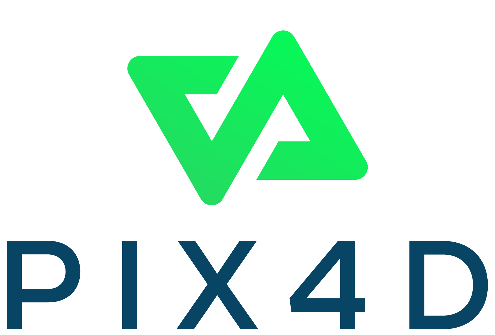
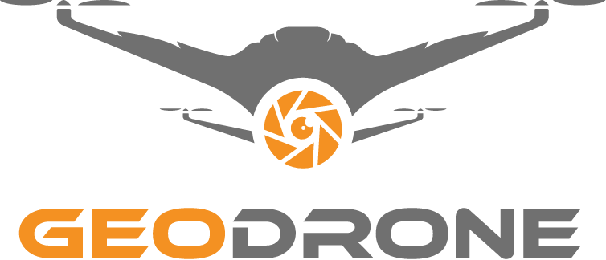

  
## Universidad Peruana de Ciencias Aplicadas

**Facultad:** Ingeniería

**Carrera:** Ingeniería de Software

**Periodo:** 2026-20

**Código del Curso**: 1ASI0730

**Curso:** Aplicaciones Web

**NRC:** 8093

**Profesor:** Efraín Ricardo Bautista Ubillús

### Informe de Trabajo Final

**Startup:** GreenTech

**Nombre del producto:** SkyCrop

#### Relación de integrantes

| Integrante                              | Código         |
|-----------------------------------------|----------------|
|                                         |   U            |
| Cano Gomez,Yam Antony                   |   U202423775   |
| Sunio Danilo Landa Sánchez              |   U202423973   |
|                                         |   U            |
|                                         |   U            |

<h3>Setiembre 2026</h3>
 

---
# Registro de Versiones del Informe 

|Versión|Fecha|Autor|Fecha de modificación|
|:------|:----|:----|:--------------------|
|||||

# Project Report Collaboration Insights 

# Contenido 

## Tabla de contenidos 
- [Registro de Versiones del Informe](#registro-de-versiones-del-informe)
- [Project Report Collaboration Insights](#project-report-collaboration-insights)
- [Contenido](#contenido)
  - [Tabla de contenidos](#tabla-de-contenidos)
- [Student Outcome](#student-outcome)
- [Capítulo I: Introducción](#capítulo-i-introducción)
  - [1.1. Startup Profile](#11-startup-profile)
    - [1.1.1. Descripción de la Startup](#111-descripción-de-la-startup)
    - [1.1.2. Perfiles de integrantes del equipo](#112-perfiles-de-integrantes-del-equipo)
  - [1.2. Solution Profile](#12-solution-profile)
    - [1.2.1 Antecedentes y problemática](#121-antecedentes-y-problemática)
    - [1.2.2 Lean UX Process.](#122-lean-ux-process)
      - [1.2.2.1. Lean UX Problem Statements.](#1221-lean-ux-problem-statements)
      - [1.2.2.2. Lean UX Assumptions.](#1222-lean-ux-assumptions)
      - [1.2.2.3. Lean UX Hypothesis Statements.](#1223-lean-ux-hypothesis-statements)
      - [1.2.2.4. Lean UX Canvas.](#1224-lean-ux-canvas)
  - [1.3. Segmentos objetivo.](#13-segmentos-objetivo)
- [Capítulo II: Requirements Elicitation \& Analysis](#capítulo-ii-requirements-elicitation--analysis)
  - [2.1. Competidores.](#21-competidores)
    - [2.1.1. Análisis competitivo.](#211-análisis-competitivo)
    - [2.1.2. Estrategias y tácticas frente a competidores.](#212-estrategias-y-tácticas-frente-a-competidores)
  - [2.2. Entrevistas.](#22-entrevistas)
    - [2.2.1. Diseño de entrevistas.](#221-diseño-de-entrevistas)
    - [2.2.2. Registro de entrevistas.](#222-registro-de-entrevistas)
    - [2.2.3. Análisis de entrevistas.](#223-análisis-de-entrevistas)
  - [2.3. Needfinding.](#23-needfinding)
    - [2.3.1. User Personas.](#231-user-personas)
    - [2.3.2. User Task Matrix.](#232-user-task-matrix)
    - [2.3.3. User Journey Mapping.](#233-user-journey-mapping)
    - [2.3.4. Empathy Mapping.](#234-empathy-mapping)
  - [2.4. Big Picture EventStorming.](#24-big-picture-eventstorming)
  - [2.5. Ubiquitous Language.](#25-ubiquitous-language)
- [Capítulo III: Requirements Specification](#capítulo-iii-requirements-specification)
  - [3.1. User Stories.](#31-user-stories)
  - [3.2. Impact Mapping.](#32-impact-mapping)
  - [3.3. Product Backlog.](#33-product-backlog)
- [Capítulo IV: Product Design](#capítulo-iv-product-design)
  - [4.1. Style Guidelines.](#41-style-guidelines)
    - [4.1.1. General Style Guidelines.](#411-general-style-guidelines)
    - [4.1.2. Web Style Guidelines.](#412-web-style-guidelines)
  - [4.2. Information Architecture.](#42-information-architecture)
    - [4.2.1. Organization Systems.](#421-organization-systems)
    - [4.2.2. Labeling Systems.](#422-labeling-systems)
    - [4.2.3. SEO Tags and Meta Tags](#423-seo-tags-and-meta-tags)
    - [4.2.4. Searching Systems.](#424-searching-systems)
    - [4.2.5. Navigation Systems.](#425-navigation-systems)
  - [4.3. Landing Page UI Design.](#43-landing-page-ui-design)
    - [4.3.1. Landing Page Wireframe.](#431-landing-page-wireframe)
    - [4.3.2. Landing Page Mock-up.](#432-landing-page-mock-up)
  - [4.4. Web Applications UX/UI Design.](#44-web-applications-uxui-design)
    - [4.4.1. Web Applications Wireframes.](#441-web-applications-wireframes)
    - [4.4.2. Web Applications Wireflow Diagrams.](#442-web-applications-wireflow-diagrams)
    - [4.4.2. Web Applications Mock-ups.](#442-web-applications-mock-ups)
    - [4.4.3. Web Applications User Flow Diagrams.](#443-web-applications-user-flow-diagrams)
  - [4.5. Web Applications Prototyping.](#45-web-applications-prototyping)
  - [4.6. Domain-Driven Software Architecture.](#46-domain-driven-software-architecture)
    - [4.6.1. Design-Level EventStorming.](#461-design-level-eventstorming)
    - [4.6.2. Software Architecture Context Diagram.](#462-software-architecture-context-diagram)
    - [4.6.3. Software Architecture Container Diagrams.](#463-software-architecture-container-diagrams)
    - [4.6.4. Software Architecture Components Diagrams.](#464-software-architecture-components-diagrams)
  - [4.7. Software Object-Oriented Design.](#47-software-object-oriented-design)
    - [4.7.1. Class Diagrams.](#471-class-diagrams)
  - [4.8. Database Design.](#48-database-design)
    - [4.8.1. Database Diagrams.](#481-database-diagrams)
- [Capítulo V: Product Implementation, Validation \& Deployment](#capítulo-v-product-implementation-validation--deployment)
  - [5.1. Software Configuration Management.](#51-software-configuration-management)
    - [5.1.1. Software Development Environment Configuration.](#511-software-development-environment-configuration)
    - [5.1.2. Source Code Management.](#512-source-code-management)
    - [5.1.3. Source Code Style Guide \& Conventions.](#513-source-code-style-guide--conventions)
    - [5.1.4. Software Deployment Configuration.](#514-software-deployment-configuration)
  - [5.2. Landing Page, Services \& Applications Implementation.](#52-landing-page-services--applications-implementation)
    - [5.2.X. Sprint n](#52x-sprint-n)
      - [5.2.X.1. Sprint Planning n.](#52x1-sprint-planning-n)
      - [5.2.X.2. Aspect Leaders and Collaborators.](#52x2-aspect-leaders-and-collaborators)
      - [5.2.X.3. Sprint Backlog n.](#52x3-sprint-backlog-n)
      - [5.2.X.4. Development Evidence for Sprint Review.](#52x4-development-evidence-for-sprint-review)
      - [5.2.X.5. Execution Evidence for Sprint Review.](#52x5-execution-evidence-for-sprint-review)
      - [5.2.X.6. Services Documentation Evidence for Sprint Review.](#52x6-services-documentation-evidence-for-sprint-review)
      - [5.2.X.7. Software Deployment Evidence for Sprint Review.](#52x7-software-deployment-evidence-for-sprint-review)
      - [5.2.X.8. Team Collaboration Insights during Sprint.](#52x8-team-collaboration-insights-during-sprint)
- [Conclusiones](#conclusiones)
- [Bibliografía](#bibliografía)
- [Anexos](#anexos)

# Student Outcome 

# Capítulo I: Introducción 

## 1.1. Startup Profile 

### 1.1.1. Descripción de la Startup 

### 1.1.2. Perfiles de integrantes del equipo 

## 1.2. Solution Profile 

### 1.2.1 Antecedentes y problemática 

### 1.2.2 Lean UX Process. 

#### 1.2.2.1. Lean UX Problem Statements. 

#### 1.2.2.2. Lean UX Assumptions. 

#### 1.2.2.3. Lean UX Hypothesis Statements. 

#### 1.2.2.4. Lean UX Canvas. 

## 1.3. Segmentos objetivo. 

# Capítulo II: Requirements Elicitation & Analysis 

## 2.1. Competidores. 

Hemos identificado a tres empresas con ofertas similares a la de nuestra startup:

- **Pix4D**: Es una empresa de software de fotogrametría, ofrece varios programas bajo licencia para usarse en varias industrias como en la agricultura. Uno de sus productos es Pix4D fields, un software híbrido de mapeo con drones para el análisis de cultivos y agricultura precisa. 
- **DJI Enterprise**: Es una empresa que ofrece drones y software para drones. Uno de sus programas es DJI Terra, el cual consiste en la reconstrucción de terrenos para la adquisición y procesamiento de datos. Este programa es aplicable a la agricultura, permitiendo programar rutas de vuelo y generar mapas de vegetación para obtener información sobre la salud y crecimiento de los cultivos.
- **Geodrone**: Es una empresa perteneciente al grupo RCP que se basa en la provisión de servicios con drones para inspecciones, limpiezas, captura de datos, agricultura, entre otros. Esta empresa además permite fabricar drones personalizados basándose en necesidades operativas. En su servicio de agricultura, la empresa ofrece análisis de cultivos para la generación de mapas NDVI, de cobertura vegetal o de elevación. Además ofrece riego, control de plagas o cosechas mediante drones.

### 2.1.1. Análisis competitivo. 

<table border="1">
  <tr>
    <th colspan="6">Competitive Analysis Landscape</th>
  </tr>
  <tr>
    <th colspan="2">¿Por qué llevar a cabo este análisis?</th>
    <td colspan="4">
      El objetivo de este analisis es conocer más sobre lo que ofrece nuestra competencia para, en base a ello, identificar en que aspectos podemos diferenciarnos y como podemos mejorar nuestro producto. Con estos avances podremos tener un mejor puesto en el mercado.
    </td>
  </tr>
  
  <tr>
  <tr>
    <th colspan="2" rowspan="2">Empresa</th>
    <th>SkyCrop</th>
    <th>Pix4D</th>
    <th>DJI Enterprise</th>
    <th>Geodrone</th>
  </tr>
  <tr>
    <td>
      
    </td>
    <td>
      
    </td>
    <td>
      
    </td>
    <td>
      
    </td>
  </tr>
  
  <tr>
  <th rowspan = "2">Perfil</th>
    <th>Overview</th>
    <td>Plataforma de gestión y configuración de rutinas de vuelo para drones capaces de generar escaneos en terrenos agrícolas.
    </td>
    <td>Plataforma de venta de licencias de software para la obtención de datos, el análisis de cultivos, creación de mapas y guardado en la nube.
    </td>
    <td>Plataforma de venta de drones y de licencias de software apto para la agricultura, capaz de evaluar la salud de cultivos y generar mapas de vegetación.
    </td>
    <td>Plataforma de servicios de drones para la generación de mapas del terreno, seguimiento de cultivos y elaboración de informes agrícolas.
    </td>
  </tr>
  <tr>
    <th>Ventaja Competitiva</th>
    <td>Enfoque en la agricultura, compatibilidad con la mayoría de drones y almacenamiento de datos históricos y de reportes avanzados.
    </td>
    <td>Alta compatibilidad con la mayoría de drones y análisis avanzado a partir de imagenes para generar prescripciones.
    </td>
    <td>Elaboración y venta de drones especializados en la agricultura junto con un programa de análisis y procesamiento.
    </td>
    <td>Servicios realizados con operadores altamente capacitados, generando varios resultados de alta calidad.
    </td>
  </tr>

  <tr>
  <th rowspan = "2">Perfil de Marketing</th>
    <th>Mercado Objetivo</th>
    <td>Agricultores e Ingenieros agrónomos.
    </td>
    <td>Arquitectos, agricultores, topógrafos, ingenieros, entre otros.
    </td>
    <td>Personal de seguridad pública, agricultores, mineros, arquitectos, entre otros.
    </td>
    <td>Ingenieros civiles, agricultores, inspectores, personal de seguridad, entre otros.
    </td>
  </tr>
  <tr>
    <th>Estrategias de Marketing</th>
    <td>Publicación del producto en redes sociales, demostración de casos de exito y alianzas con agrónomos y empresas.
    </td>
    <td>Demostraciones del software y sus resultados, además del ofrecimiento de pruebas gratuitas.
    </td>
    <td>Presentación de casos de uso, publicación de noticias en redes sociales y ofrecimiento de pruebas gratuitas.
    </td>
    <td>Demostraciones de servicios y sus beneficios, publicación de casos de exito y participación en eventos industriales.
    </td>
  </tr>

  <tr>
  <th rowspan = "3">Perfil de Producto</th>
    <th>Productos & Servicios</th>
    <td>Plataforma que programa rutinas de vuelo, escaneos del terreno y emisión de alertas. Se acompaña de un servicio de guardado en la nube para registrar datos históricos y reportes.
    </td>
    <td>Aplicación de escaneo y mapeo del terreno para el análisis de los cultivos. Permite compartir y guardar datos o informes mediante un servicio en la nube.
    </td>
    <td>Software integrable en drones para la reconstruccion de terrenos en 3D y la generación de mapas de indices de vegetación como NDVI o NDRE.
    </td>
    <td>Servicio de análisis de cultivos, generación de mapas, riego, control de plagas o cosecha mediante drones.
    </td>
  </tr>
  <tr>
    <th>Precios & Costos</th>
    <td>Subscripciones mensuales y anuales a partir de $40.
    </td>
    <td>Prueba gratuita y subscripciones mensuales o anuales a partir de $165.
    </td>
    <td>Prueba gratuita y planes anuales a partir de $300.
    </td>
    <td>Cotizable segun servicio.
    </td>
  </tr>
    <tr>
    <th>Canales de Distribución</th>
    <td>Mediante aplicación web y aplicación movil
    </td>
    <td>Mediante sitio web
    </td>
    <td>Mediante sitio web y aplicación movil
    </td>
    <td>Mediante sitio web
    </td>
  </tr>

  <tr>
  <th rowspan = "4">Análisis SWOT</th>
    <th>Fortalezas</th>
    <td>Plataforma web accesible desde cualquier dispositivo, guardado de datos históricos en la nube y alta compatibilidad con drones.
    </td>
    <td>Software especializado para diferentes industrias como en la agricultura. Además, tiene un alto rango de sistemas compatibles.
    </td>
    <td>Amplio ecosistema de drones y softwares, además de programas de alta tecnología.
    </td>
    <td>Servicios de alta calidad adaptables a las necesidades de los clientes y alta experiencia en el mercado
    </td>
  </tr>
  <tr>
    <th>Debilidades</th>
    <td>Dependencia de conectividad a la nube para el procesamiento y falta de reconocimiento de la startup.
    </td>
    <td>Alto precio de la aplicación y necesidad de capacitación.
    </td>
    <td>Alto precio de la aplicación y menor enfoque en cuanto a agricultura.
    </td>
    <td>Costo recurrente para los clientes que requieran monitoreo constante.
    </td>
  </tr>
    <tr>
    <th>Oportunidades</th>
    <td>Plataforma diseñada para ser accesible y con mayor enfoque en la agricultura.
    </td>
    <td>Aprovechamiento de las funciones offline en campos de cultivo sin internet o señal, así como el uso eficiente de los insumos ante posibles subidas de precio.
    </td>
    <td>Gran reconocimiento en diferentes industrias y posibles ventas cruzadas con dron y software.
    </td>
    <td>Ahorro para el agricultor al eliminar el costo de adquisición de drones cuyo precio va en aumento.
    </td>
  </tr>
    <tr>
    <th>Amenazas</th>
    <td>Competencia con plataformas similares con mayor experiencia en el mercado.
    </td>
    <td>Las subscripciones de alto precio que ofrece pueden alejar a empresas agricolas pequeñas.
    </td>
    <td>Sus planes de alto precio, así como la complejidad del software, pueden alejar a empresas agricolas pequeñas.
    </td>
    <td>Posibles problemas con la disponibilidad de los proveedores de servicios.
    </td>
  </tr>
</table>

### 2.1.2. Estrategias y tácticas frente a competidores. 

## 2.2. Entrevistas. 

### 2.2.1. Diseño de entrevistas. 

Las entrevistas consistirán de una serie de preguntas principales dirigidas a los segmentos objetivos junto con otras preguntas complementarias que nos brinden información adicional. 
Antes de que comience la entrevista, explicaremos nuestra solución a los entrevistados con el fin de brindar contexto.
Al comenzar la entrevista, se realizarán preguntas cortas para recaudar información básica del entrevistado, como su nombre, edad y distrito de residencia. Luego de esto, se realizarán las preguntas principales.

**Preguntas para el segmento 1: Agricultores**

1. ¿Cómo es el terreno donde cultiva? ¿Cómo lo monitorea?
2. ¿Qué herramientas suele usar para el monitoreo? ¿Qué información obtienes?
3. ¿Cuál es la mayor dificultad que enfrenta al realizar el monitoreo? ¿Qué otras dificultades encuentra? 
4. ¿Qué problemas suele encontrar en su cultivo? Cuéntenos como los suele resolver.
5. ¿Qué información de sus cultivos le gustaría conocer de forma sencilla?
6. ¿Alguna vez ha usado drones agrícolas u otras tecnologías? Cuéntenos sobre su experiencia y como las ha usado.
7. ¿Qué piensa que debería ser capaz de hacer un dron agrícola para que le sea útil en su trabajo?
8. Imagina un sistema que gestione a los drones que podría haber en tu terreno, ¿Qué espera que pudiera hacer tal sistema?
9. En este caso, el sistema obtiene información de los drones que realizan escaneos de sus cultivos, ¿Cómo le gustaría recibir y visualizar aquella información?
10. ¿Qué problemas piensa que tendría ese sistema en su terreno?
11. ¿Qué funcionalidades piensa que debería tener aquel sistema para que usted pague por ella para usarla en su trabajo?

**Preguntas para el segmento 2: Ingenieros Agrónomos**

1. ¿Qué cultivos y terrenos suele asesorar? Cuéntenos sobre ellos.
2. ¿Cómo monitorea los cultivos? ¿Qué información obtiene?
3. ¿Qué datos o indicadores considera importantes a la hora de evaluar un cultivo?
4. ¿Qué dificultades en su trabajo suele encontrar al asesorar cultivos o terrenos?
5. ¿Qué problemas del cultivo considera que se deberían detectar a tiempo? ¿Usted como los detecta?
6. ¿Qué información le gustaría obtener mediante drones agrícolas? ¿Cómo le ayudaría tal información?
7. ¿Cómo le gustaría que se le presente la información obtenida?
8. Imagine un sistema que controle a tales drones agrícolas, le ayude a planificar rutinas de vuelo y muestre la información recogida, ¿Qué factores tendría en cuenta para decidir si lo usaría en su trabajo?
9. ¿Qué trabajos dejaría que el sistema hiciera automáticamente y cuáles los haría manualmente?
10. ¿Qué funcionalidades piensa que debería tener el sistema para que pague por él y lo incorpore en su trabajo?

### 2.2.2. Registro de entrevistas. 

### 2.2.3. Análisis de entrevistas. 

## 2.3. Needfinding. 

### 2.3.1. User Personas. 

### 2.3.2. User Task Matrix. 

### 2.3.3. User Journey Mapping. 

### 2.3.4. Empathy Mapping. 

## 2.4. Big Picture EventStorming. 

## 2.5. Ubiquitous Language. 

# Capítulo III: Requirements Specification 

## 3.1. User Stories. 

|Epic / Story ID|Título|Descripción|Criterios de aceptación|Relacionado con|
|:--------------|:-----|:----------|:----------------------|:--------------|
||||||

## 3.2. Impact Mapping. 

## 3.3. Product Backlog. 

|# Orden|User Story ID|Título|Descripción|Story Points|
|:--------------|:-----|:----------|:----------------------|:--------------|
||||||

# Capítulo IV: Product Design 

## 4.1. Style Guidelines. 

### 4.1.1. General Style Guidelines. 

### 4.1.2. Web Style Guidelines. 

## 4.2. Information Architecture. 

### 4.2.1. Organization Systems. 

### 4.2.2. Labeling Systems. 

### 4.2.3. SEO Tags and Meta Tags 

### 4.2.4. Searching Systems. 

### 4.2.5. Navigation Systems. 

## 4.3. Landing Page UI Design. 

### 4.3.1. Landing Page Wireframe. 

### 4.3.2. Landing Page Mock-up. 

## 4.4. Web Applications UX/UI Design. 

### 4.4.1. Web Applications Wireframes. 

### 4.4.2. Web Applications Wireflow Diagrams. 

### 4.4.2. Web Applications Mock-ups. 

### 4.4.3. Web Applications User Flow Diagrams. 

## 4.5. Web Applications Prototyping. 

## 4.6. Domain-Driven Software Architecture. 

### 4.6.1. Design-Level EventStorming. 

### 4.6.2. Software Architecture Context Diagram. 

### 4.6.3. Software Architecture Container Diagrams. 

### 4.6.4. Software Architecture Components Diagrams. 

## 4.7. Software Object-Oriented Design. 

### 4.7.1. Class Diagrams. 

## 4.8. Database Design. 

### 4.8.1. Database Diagrams. 

# Capítulo V: Product Implementation, Validation & Deployment  

## 5.1. Software Configuration Management. 

### 5.1.1. Software Development Environment Configuration. 

### 5.1.2. Source Code Management. 

### 5.1.3. Source Code Style Guide & Conventions. 

### 5.1.4. Software Deployment Configuration. 

## 5.2. Landing Page, Services & Applications Implementation. 

### 5.2.X. Sprint n 

#### 5.2.X.1. Sprint Planning n. 

#### 5.2.X.2. Aspect Leaders and Collaborators. 

#### 5.2.X.3. Sprint Backlog n. 

#### 5.2.X.4. Development Evidence for Sprint Review. 

#### 5.2.X.5. Execution Evidence for Sprint Review. 

#### 5.2.X.6. Services Documentation Evidence for Sprint Review. 

#### 5.2.X.7. Software Deployment Evidence for Sprint Review. 

#### 5.2.X.8. Team Collaboration Insights during Sprint. 

# Conclusiones 

# Bibliografía 

# Anexos